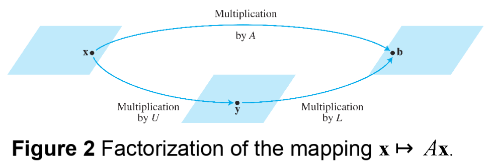
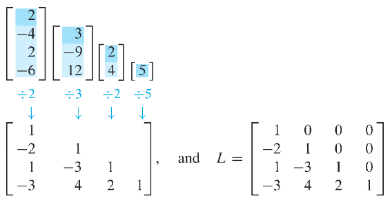

# Matrix Algebra

# Matrix Factorizations

## Matrix Factorizations

* A Factorization of a matrix $$A$$ is an equation that expresses $$A$$ as a product of two or more matrices.
* Whereas matrix multiplication involves a synthesis of data (combining the effects of two or more linear transformations into a single matrix), matrix factorization is an analysis of data.

## The LU Factorization

* The LU Factorization is motivated by the fairly common industrial and business problem of solving a sequence of equations, all with the same coefficient matrix:

\[
A\textbf{x}=\textbf{b}_1,A\textbf{x}=\textbf{b}_2 \cdots A\textbf{x}=\textbf{b}_p \tags{1}
\]

* When $$A$$ is invertible, one could compute $$A^{-1}$$ and then compute $$A^{-1}\textbf{b}_1, A^{-1}\textbf{b}_2 $$ and so on.
* However, it is more efficient to solve the first equation in the sequence (1) by row reduction and LU factorization of $$A$$ at the same time. Thereafter the remaining equations in sequence(1) are solved with the LU factorization.
* At first, assume that $$A$$ is an $$m \times n $$ matrix that can be row reduction to echelon form, without row interchanges.
* Then $$A$$ can be written in the form $$A=LU$$, where $$L$$ is an $$m\times m$$ lower triangular matrix with 1's on the diagonal and $$U$$ is an $$m \times n $$ echelon form of \(A\).
* For instance, see Fig. 1 below. Such a factorizaton is called an **LU factorization** of $$A$$. the matrix $$L$$ is invertible and is called a unit lower trinagular matrix.
* Before studying how to construct \(L\) and \(U\), we shoudl look at why they are so useful. When \(A=LU\), the equation \(A\textbf{x}=\textbf{b}\) can be written as \(L(U\textbf{x})=\textbf{b}\).
* Writing \(\textbf{y}\) for \(U\textbf{x}\), we can find \(\textbf{x}\) by solving the pair of equations 
$$
L\textbf{y}=\textbf{b} \\
U\textbf{x}=\textbf{y 
$$

* First solve \( L\textbf{y}=\textbf{b} \) for \( \textbf{y} \), and then solve \(U\textbf{x}=\textbf{y}\) for \( \textbf{x} \). See Fig 2. Each equation is easy to solve because \(L\) and \(U\) are triangular.

### Example 1

It can be verified that

$$
A=\begin{bmatrix} 3 & -7 & -2 & 2 \\ -3 & 5 & 1 & 0 \\ 6 & -4 & 0 &-5 \\-9 & 5 & -5 & 12 \end{bmatrix}=
\begin{bmatrix} 1 & 0 & 0 & 0 \\ -1 & 1 & 0 & 0 \\ 2 & -5 & 1 & 0 \\ -3 & 8 & 3 & 1 \end{bmatrix} 
\begin{bmatrix} 3 & -7 & -2 & 2 \\ 0 & -2 & -1 & 2 \\ 0 & 0 & -1 & 1 \\ 0 & 0 & 0 & -1 \end{bmatrix}
=LU
$$

Use this factorization of \(A\) to solve \(A\textbf{x}=\textbf{b}\), where \(\textbf{b}=\begin{bmatrix}-9 \\ 5\\ 7 \\ 11 \end{bmatrix} \).

#### Solution :

The solution of \(L\textbf{y}=\textbf{b} \) needs only 6 multiplications and 6 additions, because the arithmetic takes place only in column 5.

$$
\begin{bmatrix}L & \textbf{b}\end{bmatrix} = 
\begin{bmatrix} 1 & 0 & 0 & 0 & -9 \\ -1 & 1 & 0 & 0 & 5 \\ 2 & -5 & 1 & 0 & 7 \\ -3 & 8 & 3 & 1 & 11 \end{bmatrix}
\text{~}
\begin{bmatrix} 1 & 0 & 0 & 0 & -9 \\ 0 & 1 & 0 & 0 & -4 \\ 0 & 0 & 1 & 0 & 5 \\ 0 & 0 & 0 & 1 & 1 \end{bmatrix}
\begin{bmatrix}I & \textbf{y}\end{bmatrix} 
$$

* Then, for \( U \textbf{x}=\textbf{y} \), the "backward" phase of row reduction requires 4 divisions, 6 multiplications, and 6 additions.
* For instance, creating the zeros in column 4 of \( \begin{bmatrix} U & \textbf{y} \end{\bmatrix} \) requires 1 division in row 4 and 3 multiplication-addition pairs to add multiples of row 4 to the rows above.

$$
\begin{bmatrix}U & \textbf{y}\end{bmatrix} = 
\begin{bmatrix} 3 & -7 & -2 & 2 & -9 \\ 0 & -2 & -1 & 2 & -4 \\ 0 & 0 & -1 & 1 & 5 \\ 0 & 0 & 0 & -1 & 1 \end{bmatrix}
\text{~}
\begin{bmatrix} 1 & 0 & 0 & 0 & 3 \\ 0 & 1 & 0 & 0 & 4 \\ 0 & 0 & 1 & 0 & -6 \\ 0 & 0 & 0 & 1 & -1 \end{bmatrix},
\textbf{x}=\begin{bmatrix} 3 \\ 4\\-6 \\ -1 \end{bmatrix}
$$

* To find \( \textbf{x} \) requires 28 arithmetic operations, or "flops"(floating point operations), excluding the cost of finding \(L\) and \(U\). In contrast, row reduction of \( \begin{bmatrix} A & \textbf{b} \end{bmatrix}\) to \( \begin{bmatrix} I \textbf{x} \end{bmatrix} \) takes 62 operations.

## An LU Factorization Alogrithm

* Suppose \(A\) can be reduced to an echelon form \(U\) using only row replacements that add a multiple of one row to another below it.
* In this case, there exist unit lower triangular elementary matrices \( E_1 \cdots E_p \) such that

$$
E_p \cdots E_1 A = U \tags{3}
$$

* Then

$$
A = (E_p \cdots E_1 )^{-1}U = LU
$$

* where

$$
L = (E_p \cdots E_1) ^{-1} \tags{4}
$$

* It can be shown that products and inverses of unit lower triangular matrices are also unit lower triangular. Thus L is unit lower triangular.
* Note that row operations in equation (3), which reduce \(A\) to \(U\), also reduce the \(L\) in equation (4) to \(I\), because \( E_p \cdots E_1 L = (E_p \cdots E_1)(E_p \cdots E_1)^{-1}=I \). This observation is the key to constructing \(L\).

### Algorithm for an L U Factorization

1. Reduce \(A\) to an echelon form \(U\) by a sequence of row replacement operations, if possible.
2. Place entries in \(L\) such that the same sequence of row operations reduces \(L\) to \(I\).

* Step 1 is not always possible, but when it is, the argument above shows that an \(L U\) factorization
exists.
* Example 2 will show how to implement step 2. By construction, \(L\) will satisfy \( (E_p\cdots E_1)L = I\) using the same \( E_p, \cdots E_1 \) as in equation (3). Thus \(L\) will be invertible, by the invertible matrix theorem, with \( (E_p \cdots E_1 ) = L^{-1} \). From (3), \( L^{-1} A = U \), and \( A = LU \). So step 2 will produce an acceptable \( L \).

### Example 2

Find an \(LU\) factorization of

$$
A =\begin{bmatrix} 2 & 4 & -1 & 5 & -2 \\ -4 & -5 & 3 & -8 & 1 \\ 2 & -5 & -4 & 1 & 8 \\ -6 & 0 & 7 & -3 & 1 \end{bmatrix}
$$

#### Solution :

Since A has four rows, L should be \( 4 \times 4 \). The first column of L is the first column of A
divided by the top pivot entry:

$$
L =\begin{bmatrix} 1 & 0 & 0 & 0 \\ -2 & 1 & 0 & 0 \\ 1 &  & 1 & 0 \\ -3 &  &  & 1 \end{bmatrix}
$$

* Compare the first columns of A and L. The row operations that
create zeros in the first column of A will also create zeros in the
first column of L.

To make this same correspondence of row operations on A hold
for the rest of L, watch a row reduction of A to an echelon form U.
That is, highlight the entries in each matrix that are used to
determine the sequence of row operations that transform A onto U.

The highlighted entries above determine the row reduction
of A to U. At each pivot column, divide the highlighted
entries by the pivot and place the result onto L:

* An easy calculation verifies that this \(L\) and \(U\) satisfy \(LU=A\)
