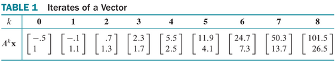
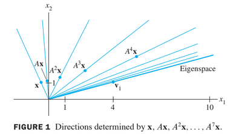
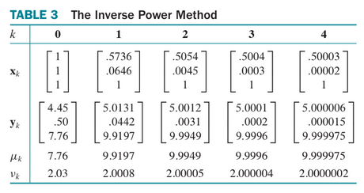

#

# 5.8 ITERATIVE ESTIMATES FOR EIGENVALUES

In scientific applications of linear algebra, **eigenvalues are seldom known precisely**.
Fortunately, **a close numerical approximation is usually quite satisfactory**. 

In fact, some applications require *only a rough approximation to* **the largest eigenvalue**. The first algorithm described below can work well for this case. 

Also, it provides a foundation for a more powerful method that can give fast estimates for other eigenvalues as well.

## The Power Method

**The power method** applies to an $$n \times n$$ matrix $$A$$ with a **strictly dominant eigenvalue $$\lambda_1$$**, which means that $$\lambda_1$$ must be larger in absolute value than all the other eigenvalues.

In this case, the power method produces a scalar sequence that approaches $$\lambda_1$$ and a
vector sequence that approaches a corresponding eigenvector. 

The background for the method rests on **the eigenvector decomposition** used at the beginning of Section 5.6.

Assume for simplicity that $$A$$ is diagonalizable and $$\mathbb{R}^n$$ has a basis of eigenvectors $$\mathbb{v}_1 \cdots \mathbb{v}_n$$, arranged so their corresponding eigenvalues $$\lambda_1, \cdots, \lambda_n $$ decrease in size, with the strictly dominant eigenvalue first. That is,

$$
|\lambda_1| \gg |\lambda_2| \gt \cdots \gt |\lambda_n| \tag{1}
$$

If $$\textbf{x} \in \mathbb{R}^n$$ is written as $$ \textbf{x} = c_1 \textbf{v}_1 + \cdots c_n \textbf{v}_n $$, then

$$
A^k \textbf{x} = c_1 (\lambda_1)^k \textbf{v}_1 + c_2 (\lambda_2)^k \textbf{v}_2 + \cdots + c_n (\lambda_n)^k \textbf{v}_n \quad (k=1,2,\cdots)
$$

Assume $$c_1 \ne 0 $$. Then, dividing by $$(\lambda_1)^k$$,

$$
\frac{1}{(\lambda_1)^k}A^k \textbf{x} = c_1 \textbf{v}_1 + c_2 \frac{(\lambda_2)^k}{(\lambda_1)^k} \textbf{v}_2 + \cdots + c_n \frac{(\lambda_n)^k}{(\lambda_1)^k} \textbf{v}_n \quad (k=1,2,\cdots) \tag{2}
$$

From inequaliy (1), the fraction $$\frac{(\lambda_2)^k}{(\lambda_1)^k}, \cdots, \frac{(\lambda_n)^k}{(\lambda_1)^k}$$ are all less than 1 in magnitude and so their powers go to zero. Hence

$$
(\lambda_1)^{-k} A^k \textbf{x} \leftarrow c_1 \textbf{v}_1 \quad \text{ as } k\leftarrow \infty \tag{3}
$$

Thus, for large $$k$$, a scalar multiple of $$A^k \textbf{x}$$ determines almost the same *direction* as the eigenvector $$c_1\textbf{v}_1$$. Since positive scalar multiples do not change the direction of a vector, $$A^k \textbf{x}$$ itself points almost in the same direction as $$\textbf{v}_1 $$ or $$-\textbf{v}_1$$, provided $$c1 \ne 0$$.

## Example 1

Let $$A=\begin{bmatrix}1.8 & .8 \\ .2 & 1.2 \end{bmatrix}, \textbf{v}_1=\begin{bmatrix} 4 \\1 \end{bmatrix}, \text{ and } \textbf{x}=\begin{bmatrix} -.5 \\1 \end{bmatrix}$$. Then $$A$$ has eigenvalues 2 and 1, and the eigenspace for $$\lambda_1 =2$$ is the line through $$\textbf{0}$$ and $$\textbf{v}_1$$. For $$k=0, \cdots, 8$$, compute $$A^k\textbf{x}$$ and construct the line through $$\textbf{0}$$ and $$A^k\textbf{x}$$. What happens as $$k$$ increases?

### Solution

The first three calcuations are

$$
\begin{align*}
A\textbf{x} &= \left[ \begin{matrix} 1.8 & .8 \\ .2 & 1.2 \end{matrix} \right]
\left[ \begin{matrix} -.5 \\ 1 \end{matrix} \right] =
\left[ \begin{matrix} -.1 \\ 1.1 \end{matrix} \right] \\
A^2\textbf{x} = A(A\textbf{x}) &= \left[ \begin{matrix} 1.8 & .8 \\ .2 & 1.2 \end{matrix} \right]
\left[ \begin{matrix} -.1 \\ 1.1 \end{matrix} \right] =
\left[ \begin{matrix} -.7 \\ 1.3 \end{matrix} \right] \\
A^3\textbf{x} = A(A^2\textbf{x}) &= \left[ \begin{matrix} 1.8 & .8 \\ .2 & 1.2 \end{matrix} \right]
\left[ \begin{matrix} -.7 \\ 1.3 \end{matrix} \right] =
\left[ \begin{matrix} 2.3 \\ 1.7 \end{matrix} \right] 
\end{align*}
$$

Analogous calculations complete Table 1.

The vectors $$\textbf{x}, A\textbf{x}, A^2\textbf{x}, \cdots, A^4\textbf{x}$$ are shown in Figure 1 below.

The angle between the line (subspace) determined by $$A^k\textbf{x}$$ and the line (eigenspace) determined by $$\textbf{v}_1$$ goes to zero as $$k \mapsto \infty$$.

The vectors $$(\lambda_1)^{-k}A^k\textbf{x}$$ in (3) are scaled to make them converge to $$ c_1 \textbf{v}_1$$, provided $$c1 \ne 0$$. We cannot scale $$A^k \textbf{x}$$ in this way because we do not know $$(\lambda_1)$$. But we can scale each $$A^k \textbf{x}$$ to make its largest entry a 1. It turns out that the resulting sequence $$\left\{ \textbf{x}_k \right\}$$ will converge to a multiple of $$\textbf{v}_1$$ whose largest entry is 1. Figure 2 shows the scaled sequence for Example 1. The eigenvalue $$(\lambda_1)$$ can be estimated from the sequence $$\left\{ \textbf{x}_k \right\}$$, too. When $$\textbf{x}_k$$ is close to an eigenvector for $$(\lambda_1)$$, the vector $$A^k\textbf{x}_k$$ is close to $$\lambda_1\textbf{x}_k$$, with each entry in $$A\textbf{x}_k$$ approximately $$\lambda_1$$ times the corresponding entry in $$\textbf{x}_k$$. Because the largest entry in $$\textbf{x}_k$$ is 1, the largest entry in $$A\textbf{x}_k$$ is close to $$\lambda_1$$. (Careful proofs of these statements are omitted.)

## THE POWER METHOD FOR ESTIMATING A STRICTLY DOMINANT EIGENVALUE

1. Select an initial vector $$\textbf{x}_0$$ whose largest entry is 1.
2. For $$k=1,\cdots,$$
  a. Compute $$A\textbf{x}_k$$.
  b. Let $$\mu_k$$ be an entry in $$A\textbf{x}_k$$ whose absolute value is as large as possible
  c. Comput $$\textbf{x}_{k+1} = \frac{1}{\mu_k}A\textbf{x}_k$$.
3. For almost all choices of $$\textbf{x}_0$$, the sequence $$\left\{ \mu_k \right\}$$ approaches the dominant eigenvalue, and the sequence $$\left\{ \textbf{x}_k \right\}$$ approaches a corresponding eigenvector. 

## The Inverse Power Method

The inverse power method for estimating an eigenvalue $$\lambda$$ of $$A$$

1. Select an initial estimate $$\alpha$$ sufficiently close to $$\lambda$$.
2. Select an initial vector $$\textbf{x}_0$$ whose largest entry is 1.
3. For $$k=0,1, \cdots$$
  a. Solve $$(A-\alpha I) \textbf{y}_k = \textbf{x}_k$$ for $$\textbf{y}_k$$
  b. Let $$\mu_k$$ be an entry in $$\textbf{y}_k$$ whose absolute value is as large as possible.
  c. Compute $$\nu_k = \alpha + \frac{1}{\mu_k}$$.
  d. Compute $$\textbf{x}_{k+1} = \frac{1}{\mu_k} \textbf{y}_k$$.
4. For almost all choices of $$\textbf{x}_0$$, the sequence $$\left\{\nu_k\right\}$$ approaches the eigenvalue $$\lambda$$ of $$A$$, and the sequence $$\left\{ \textbf{x}_k \right\}$$ approaches a corresponding eigenvector.

## Example 3

It is not uncommon in some applications to need to know the smallest eigenvalue of a matrix
$$A$$ and to have at hand rough estimates of the eigenvalues.

Suppose 21, 3.3, and 1.9 are estimates for the eigenvalues of the matrix $$A$$ below. Find the smallest eigenvalue, accurate to size decimal places.

$$
A=\begin{bmatrix}
10 & -8 & -4 \\
-8 & 13 & 4 \\
-4 & 5 & 4 \\
\end{bmatrix}
$$

### Solutions

The smallest eigenvalues seem close together so we use the inverse power method for $$A-1.9I$$. Results of a Python numpy calculation are shown in Table 3 below:

Here $$\textbf{x}_0$$ was chosen arbitrarily, $$\textbf{y}_k = (A-1.9I)^{-1}\textbf{x}_k$$, $$\mu_k$$ is the largest entry in $$\textbf{y}_k$$, $$\nu_k = 1.9+\frac{1}{\mu_k}\textbf{y}_k$$.

As it turns out, the initial eigenvalue estimate was fairly good, and the inverse power sequence converged quickly. The smallest eigenvalue is exactly 2.

If an estimate for the smallest eigenvalue of a matrix is not available, one can simply
take $$\alpha=0$$ in the inverse power method. This choice of $$\alpha$$ works reasonably well if the smallest eigenvalue is much closer to zero than to the other eigenvalues.