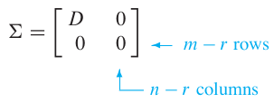

# Ch 07 Symmetric Matrices and Quadratic Forms

# 7.4 The Singular Value Decomposition (1)

**The diagonalization theorems** in Sections 5.3 and 7.1 play a part in many interesting applications. **Unfortunately, as we know, not all matrices can be factored as $$A=PDP^{-1}$$ with D diagonal**. However, a factorization $$A=QDP^{-1}$$ is possible for any $$m \times n$$ matrix A! 
A special factorization of this type, called the *singular value decomposition*,
is one of the **most useful matrix factorizations** in applied linear algebra.

The singular value decomposition is based on 
**the following property of the ordinary diagonalization** 
that can be imitated for rectangular matrices: 
The **absolute values of the eigenvalues** of a symmetric matrix $$A$$ measure the amounts that $$A$$ stretches or shrinks certain vectors (the **eigenvectors**). 

If $$A\textbf{x}=\lambda\textbf{x}$$ and $$||\textbf{x}||=1$$, then

$$
\begin{align *}
||A\textbf{x}|| &= ||\lambda\textbf{x}|| \\
&= |\lambda |||\textbf{x}||
&= |\lambda | \tag{1}
\end{align *}
$$

If $$\lambda_1$$ is **the eigenvalue with the greatest magnitude**, 
then a corresponding unit eigenvector $$\textbf{v}_1$$ identifies a direction 
in which the stretching effect of $$A$$ is greatest. 
That is, the length of $$A\textbf{x}$$ is maximized 
when $$\textbf{x}_1=\textbf{v}_1$$, and $$||A\textbf{v}_1||=|\lambda_! ||$$, by (1). 
This description of $$\textbf{v}_1$$ and $$|\lambda_1 |$$ has an analogue 
for **rectangular matrices** 
that will lead to the *singular value decomposition*.

## Example 1

If $$A=\begin{bmatrix}
4 & 11 & 14 \\
8 & 7 && -2 
\end{bmatrix}$$, then the linear transformation $$\textbf{x} \mapsto A\textbf{x}$$ maps the unit sphere $$\left\{ \textbf{x}: ||\textbf{x}||=1\rifht\}$$ in $$\mathbb{R}^3$$ onto an ellipse in $$\mathbb{R}^2$$, shown figure 1. 
Find a unit vector $$\textbf{x}$$ at which the length $$||A\textbf{x}||$$ is maximized, and compute this maximum length.

### Solution of Example 1

Example 1 suggests that 
the effect of $$A$$ on the unit sphere in $$\mathbb{R}^3$$ 
is related to 
the quadratic form $$\textbf{x}^TA\textbf{x}$$. 
In fact, the entire geometric behavior of 
the transformation $$\textbf{x} \mapsto A\textbf{x}$$ 
is captured by **this quadratic form**, as we shall see.

## The Singular Values of an $$m$$ by $$n$$ Matrix

Let $$A$$ be an $$m \times n$$ matrix. Then $$A^TA$$ is symmetric and can be orthogonally diagonlized.
Let $$\left\{ \textbf{v}_1 \cdots \textbf{v}_n \right\}$$ be an orthonormal basis for $$\mathbb{R}^n$$ consisting of eigenvectors of $$A^TA$$, and let $$\lambda_1, \cdots \lambda_n$$ be the associated eigenvalue of $$A^TA$$. Then, for $$1\le i\le n$$,

$$
\begin{align*}
||A\textbf{v}_i||^2 &= (A\textbf{v}_i)^TA\textbf{v}_i \\
&= \textbf{v}_i^T A^T \textbf{v}_i \\
&= \textbf{v}_i^T(\lambda_i \textbf{v}_i) & \text{Since }\textbf{v}_i\text{ is an eigenvector of }A^TA \\
&= \lambda_i &\text{Since }\textbf{v}_i\text{ is a unit vector} \tag{2}
\end{align*}
$$

So the eigenvalues fo $$A^TA$$ are all nonnegative.
By renumbering, if necessary, we may assume that the eigenvalues are arranged so that

$$
\lambda_1 \ge \lambda_2 \ge \cdots \ge \lambda_n \ge 0
$$

The **singular values** of $$A^TA$$ are 
the square roots of the eigenvalues of $$A^TA$$, 
denoted by $$\sigma_1, \cdots, \sigma_n$$, and
they are arranged in decreaing order.
That is, $$\sigma_i = \sqrt{\lambda_i}$$ for $$1\le i \le n$$. 

By equation (2), *the singular values of $$A$$ are the lengths of the vectors $$A\textbf{v}_1, \cdots A\textbf{v}_n$$.

---
## Theorem 9

Suppose 
$$\left\{ \textbf{v}_1 \cdots \textbf{v}_n \right\}$$ is 
an orthonormal basis of $$\mathbb{R}^n$$ 
consisting of eigenvectors of $$A^TA$$, 
arranged so that corresponding eigenvalues of $$A^TA$$ 
satisfy $$\lambda_1 \ge \cdots \lambda_n$$, and 
suppose $$A$$ has $$r$$ nonzero singular values.
Then $$\left\{ A\textbf{v}_1 \cdots A\textbf{v}_n \right\}$$ is 
an orthogonal basis for $$\text{Col} A$$, and $$\text{rank} A=r$$

---

### Proof of Theorem 9

Because $$\textbf{v}_i$$ and $$\lambda_j \textbf{v}_j$$ are orthogonal for $$i \ne j$$,

$$
\begin{align*}
(A\textbf{v}_i)^T(A\textbf{v}_j) &= \textbf{v}_i^T A^T A\textbf{v}_j \\
&=\textbf{v}_i)^T (\lambda_j \textbf{v}_j)
&=0
$$

Thus $$\left\{ A\textbf{v}_1 \cdots A\textbf{v}_n \right\}$$ is an orthogonal set.
Furthermore, since the length of the voectors $$A\textbf{v}_1 \cdots A\textbf{v}_n$$ are the singular values of $$A$$, and since there are $$r$$ nonzero singular vectors, 
$$A\textbf{v}_i \ne \textbf{0}$$ if and only if $$1\le i\le$$.
So $$\left\{ A\textbf{v}_1 \cdots A\textbf{v}_n \right\}$$ are linearly independent vectors, and they are in $$\text{Col} A$$. 
Finally, for any $$\textbf{y}$$ in $$\text{Col} A$$ —say,$$\textbf{y}=A\textbf{x}$$—we can write $$\textbf{x} = c_1\textbf{v1}+\cdots+c_n\textbf{vn}$$, and

$$
\begin{align*}
\textbf{y} &= A\textbf{x} \\
&= c_1 A \textbf{v}_1 +\cdots+ c_r A \textbf{v}_r + c_{r+1} A \textbf{v}_{r+1}+ \cdots +cn A \textbf{v}_n \\
&= c_1 A \textbf{v}_1 +\cdots+ c_r A \textbf{v}_r +\textbf{0}+\cdots+\textbf{0}
\end{align*}
$$

Thus 
$$\textbf{y}$$ is in Span $$\left\{ A\textbf{v}_1 \cdots A\textbf{v}_n \right\}$$, 
which shows that 
$$\left\{ A\textbf{v}_1 \cdots A\textbf{v}_r \right\}$$ is 
an (orthogonal) basis for $$\text{Col} A$$.
Hence $$\text{rank }A=dim \text{Col }A=r$$.
$$\blacksquare$$

---
## Theorem 10: The Singular Value Decomposition

he decomposition of $$A$$ involves an $$m \times n$$ “diagonal” matrix $$\Sigma$$ of the form

 $$\tag{3}$$

where $$D$$ is an $$r \times r$$ diagonal matrix for some $$r$$ not excedding the smaller of $$m$$ and $$n$$. (If $$r$$ equals $$m$$ or $$n$$ or both, some or all of the zero matrices do not appear.)

Let $$A$$ be an $$m \times n$$ matrix with rank $$r$$. Then there exists an $$m \times n$$ matrix $$\Sigma$$ as in (3) for which the diagonal entries in $$D$$ are the first $$r$$ singular values of $$A$$, $$\sigma_1 \ge \sigma_2 \cdots, \sigma_r >0$$, and there exists an $$m \times m$$ orthogonal matrix $$U$$ and an $$n \times n$$ orthogonal matrix $$V$$ such that 
$$
A=U\SigmaV^T
$$

---

Any factorization $$A=U\SigmaV^T$$, 
with $$U$$ and $$V$$ orthogonal, 
$$\Sigma$$ as in (3), 
and positive diagonal entries in $$D$$, 
is called a **singular value decomposition (or SVD) of $$A$$**.

The columns of $$U$$ in such a decomposition are called **left singular vectors of $$A$$**, and 
the columns of $$V$$ are called **right singular vectors of $$A$$**.

### Proof of SVD

Let $$\lambda_i$$ and $$\textbf{v}_i$$ be as in Theorem 9, 
so that $$\left\{ A\textbf{v}_1 \cdots A\textbf{v}_r \right\}$$ is an orthogonal basis for $$\text{Col }A$$.

Normalize each $$A\textbf{v}_i$$ to obtain an orthonormal basis $$\left\{ \textbf{u}_1 \cdots \textbf{u}_r \right\}$$, where

$$
\begin{aling*}
\textbf{u}_i &= \frac{1}{||A\textbf{v}_i||}A\textbf{v}_i \\
&= \frac{1}{\sigma_i}A\textbf{v}_i
\end{aling*}
$$

And

$$
A\textbf{v}_i = \sigma_i \textbf{u}_i \quad (1 \le i \le r) \tag{4}
$$

Now extend $$\left\{ \textbf{u}_1, \cdots, \textbf{u}_r\right\}$$ to an orthonormal basis $$\left\{ \textbf{u}_1, \cdots, \textbf{u}_m\right\}$$ of $$\mathbb{R}^m$$, and let

$$U = 
\begin{bmatrix}
\textbf{u}_1 & \textbf{u}_2 & \cdots \textbf{u}_m 
\end{bmatrix}
$$ and $$
V = 
\begin{bmatrix}
\textbf{v}_1 & \textbf{v}_2 & \cdots \textbf{v}_n 
\end{bmatrix}
$$

By construction, $$U$$ and $$V$$ are orthogonal matrices. Also, from (4),

$$
\begin{align*}
AV &= 
\begin{bmatrix}
A\textbf{v}_1 & \cdots & A\textbf{v}_r & \textbf{0} & \textbf{0}
\end{bmatrix} \\
&= \begin{bmatrix}
\sigma_1\textbf{u}_1 & \cdots & \sigma_r\textbf{u}_r & \textbf{0} & \textbf{0}
\end{bmatrix}
\end{align*}
$$

Let $$D$$ be the diagonal matrix with diagonal entries $$\sigma_1 \cdots \sigma_r$$, and let $$\Sigma$$ be as in
(3) above. Then

![e1][./fig/la_07_04_e1.png]

Since $$V$$ is an orhtogonal matrix, $$U\Sigma V^T = AV V^T = A$$. 
$$blacksquare$$

The next two examples focus attention on the internal structure of a singular value
decomposition. An efficient and numerically stable algorithm for this decomposition
would use a different approach.
