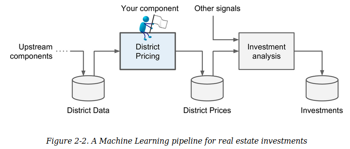
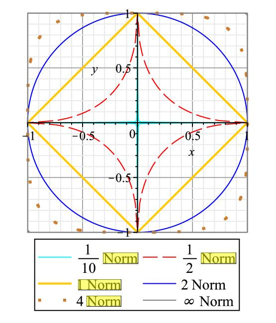

# Ch02. End-to-End Machine Learning Project

In this chapter, you will **go through an example project end to end**, pretending to be a recently hired data scientist in a real estate company.

Here are **the main steps** you will go through:

1. Look at the big picture.
2. Get the data.
3. Discover and visualize the data to gain insights.
4. Prepare the data for Machine Learning algorithms.
5. Select a model and train it.
6. Fine-tune your model.
7. Present your solution.
8. Launch, monitor, and maintain your system.

## Working with Real Data

In this chapter we chose **the California Housing Prices dataset** from the StatLib repository
This dataset was based on data **from the 1990 California census**.
> The original dataset appeared in R. Kelley Pace and Ronald Barry, “Sparse Spatial Autoregressions,” Statistics & Probability Letters 33, no. 3 (1997): 291–297.

## Look at the big piture

The task you are asked to perform is 
**to build a model of housing prices in California**
* using the California census data.
* This data has metrics such as 
  * the population, 
  * median income, 
  * median housing price, 
  * and so on 
* for each **block group** in California. 

> **Block groups** are the smallest geographical unit 
> * for which the US Census Bureau publishes sample data 
> * (a block group typically has a population of 600 to 3,000 people). 
> We will just call them **“districts”** for short.

### Frame the Problem

#### 1. Define **the objective** in **business terms**.
#### 2. How will your solution be used?

* What exactly is the business objective; building a model is probably not the end goal.
* How does the user (~MD) expect to use and benefit from **the resultant model**?
  * This is important because it will determine 
    * how you frame the problem, 
    * what algorithms you will select, 
    * what performance measure you will use to evaluate your model, and 
    * how much effort you should spend tweaking it.
    
**Ans.**

Our model’s output (**a prediction of a district’s median housing price**) will be fed to another Machine Learning system (see Figure 2-2), along with many other **signals**.



> **PIPELINES**
>
> * A sequence of data processing components
> * Pipelines are very common in Machine Learning systems, since there is a lot of data to manipulate and many data transformations to apply.
> * Each component of pipelines typically runs asynchronously. 
> * Each component is fairly self-contained: the interface between components is simply the **data store**.

#### 3. What are the current solutions/workarounds (if any)?

* It will often give you 
  * a **reference performance**, as well as 
  * **insights on how to solve the problem**. 

**Ans.**

The district housing prices are currently estimated manually by experts: 
* a team gathers up-to-date information about a district, and 
* when they cannot get the median housing price, they estimate it using complex rules.
* costly and time-consuming, and their estimates are not great;
  * their estimates were off by more than 20%
  
#### 4. How should you frame this problem

* Is it supervised, unsupervised, or Reinforcement Learning? 
* Is it a classification task, a regression task, or something else? 
* Should you use batch learning or online learning techniques?

**Ans.**

* A typical supervised learning task since we are given **labeled training examples** 
  * Each instance comes with the expected output, i.e., the district’s median housing price
* A typical regression task, since you are asked to predict a value
  * More specifically, this is a **multiple regression problem** 
    * since the system will use **multiple features** to make a prediction
  * Univariate regression problem 
    * since we are only trying to predict **a single value for each district**.
    * multivariate regression problem : predict multiple values per instance.
* Plain batch learning
  * There is no continuous flow of data coming in the system.
  * There is no particular need to adjust to changing data rapidly.
  * The data is small enough to fit in memory.
  
#### 5. **How should performance be measured?**

A typical performance measure for regression problems is **the Root Mean Square Error (RMSE)**.

$$
\text{RMSE}(\textbf{X},h) = \sqrt { \frac{1}{m} \sum^m_{i=1} \left( h(\textbf{x}_i)-y_i \right)^2}
$$

where

* $$m$$ is the number of instance in the dataset you are measuring the RMSE on.
* $$x_i$$ is a vector of all the feature values (excluding the label) of the i-th instance in the dataset.
* $$y_i$$ is i-th label (the disired output value for i-th instance)
* $$X$$ is a matrix containing all the feature values (excluding labels) of all instances in the dataset.
* $$h$$ is the prediction function, also called a *hypothesis*.
* $$\text{RMSE}(\textbf{X},h)$$ is the **cost function** measured on the set of examples (=$$X$$) using your hypothesis $$h$$.


In the case having so many outlier data, **the Mean Absolute Error (MAE)** is prefered.

$$
\text{MAE}(\textbf{X},h) = \frac{1}{m} \sum^m_{i=1} \left| h(\textbf{x}_i)-y_i \right|
$$

Both the **RMSE** and the **MAE** are *ways to measure **the distance between two vectors*** : the vector of predictions and the vector of target values. 

Various distance measures, or **norms**, are possible:

* l0-norm : $$ || \cdot ||_0 $$
  * reqularization : spare weight 
  * NP-hard problem
* Manhattan norm (l1-norm, MAE, Lasso) : $$ || \cdot ||_1 $$
  * reqularization : smaller and spare weight 
  * Relaxing L0 norm regularization, because the case of L0 norm is NP hard problem
* Euclidean norm (l2-norm, RMSE, Ridge, the root of a sum of square) : $$ || \cdot ||_2 $$
  * reqularization : smaller and uniform weight 
  * Equivalent to MAP estimation with Gaussian prior 
* lp-norm
  * The higer the norm index (p), the more it focuses on large values and neglects small ones.
  * requlrization
    * All p-norm penalize larger weights.
    * p<2 tends to create sparse (i.e. lots of 0 weights)
    * p>=2 tends to like similar weights.
    * $$l\infty$$-norm gives the maximum absolute value in the vector.




#### norm

* vector의 length 혹은 magnitude로 불림.
* 3차원 공간에서 Euclidean Norm은 다음과 같이 정의됨.
$$ 
\left\| \vec { a }  \right\| ={ \left\| \vec { a }  \right\|  }_{ 2 }={ \left( { a }_{ 1 }^{ 2 }+{ a }_{ 2 }^{ 2 }+{ a }_{ 3 }^{ 2 } \right)  }^{ \frac { 1 }{ 2 }  } 
$$
* 일반화된 P-norm은 다음과 같음.
$$ 
{ \left\| \vec { a }  \right\|  }_{ P }=\left\{ \sum _{ i=1 }^{ n }{ { \left| { a }_{ i } \right|  }^{ P } }  \right\} ^{ \frac { 1 }{ P }  }
$$
* Euclidean norm의 경우 $P$=2임.
* **norm**은 다음의 조건을 만족함.
1. $ { \left\| \vec { a }  \right\|  }_{ P }\ge 0 $ , $ \vec { a } =\vec{0} $일 경우, $ { \left\| \vec { a }  \right\|  }_{ P }=0 $.
2. $ { \left\| C \vec{a} \right\| }_P = \left\| C \right\| { \left\| \vec{a} \right\| }_{P} $. 여기서 C는 상수. (양의 동차성)
3. $ { \left\| \vec { a } +\vec { b }  \right\|  }_{ P }\le { \left\| \vec { a }  \right\|  }_{ P }+{ \left\| \vec { b }  \right\|  }_{ P } $.

## Get the Data

In typical environments your data would be available in a **relational database** (or some other common **datastore**) and **spread across multiple tables/documents/files**. 

To access it, 
* you would first need to get 
  * your credentials and 
  * access authorizations, and 
* familiarize yourself with **the data schema**.

In this project, however, things are much simpler: you will just download a single compressed file, housing.tgz, which contains **a comma-separated value (CSV)** file called **housing.csv** with all the data.

> Automating the process of fetching the data is also useful if you need to install the dataset on multiple machines.

```python
import os
import tarfile
from six.moves import urllib

#-----------------------------
# 변수 초기화
HOUSING_PATH = os.path.join("datasets", "housing")
DOWNLOAD_ROOT = "https://raw.githubusercontent.com/ageron/handson-ml/master/"
HOUSING_URL = DOWNLOAD_ROOT + "datasets/housing/housing.tgz"

#-----------------------------
# Dataset 디렉토리 생성 및 housing.csv 위치 설정.
if not os.path.isdir(HOUSING_PATH):
    os.makedirs(HOUSING_PATH)

tgz_path = os.path.join(HOUSING_PATH,'housing.tgz') 
    
#-----------------------------
# !wget https://raw.githubusercontent.com/ageron/handson-ml/master/datasets/housing/housing.tgz    
urllib.request.urlretrieve(HOUSING_URL, tgz_path) 
    
#-----------------------------
# 압축 해제.
# !tar xvfz housing.tgz   
housing_tgz = tarfile.open(tgz_path)
housing_tgz.extractall(path=HOUSING_PATH)
housing_tgz.close()
```

## Take a Quick Look at the Data Structure

```python
import pandas as pd

# to load the data using Pandas DataFrame object!
def load_housing_data(housing_path=HOUSING_PATH):
    csv_path = os.path.join(housing_path, "housing.csv")
    return pd.read_csv(csv_path)

# take a look at the top five rows
housing = load_housing_data()
housing.head()
```