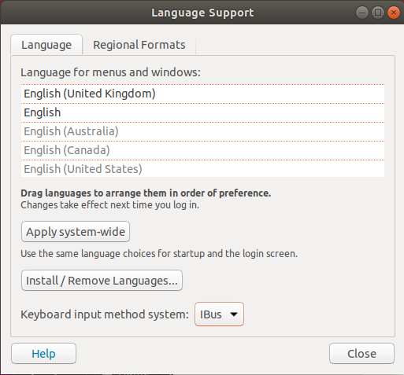
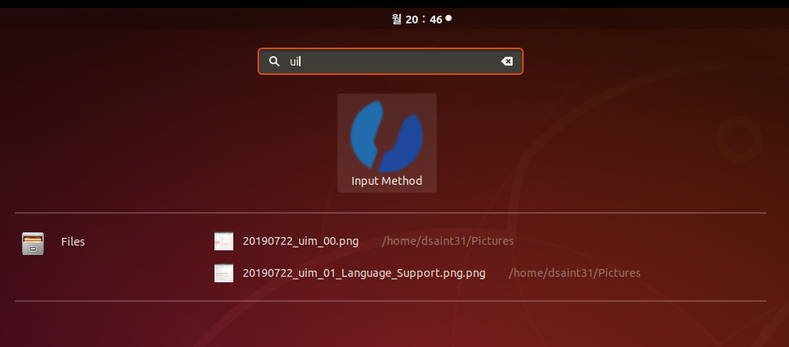

# Install UIM for Ubuntu 18.04

debian에서 ubuntu로 다시 돌아오게됨(타의로... ==;;)

이때, ubuntu의 경우, IBus가 기본 입력기인데 문제는 주로 쓰는 slack에서 한글 입력이 되질 않았음.
때문에 uim으로 입력기를 교체함.

## uim 설치.

```
sudo apt-get install uim
```

## 기본 입력기 변경

* Windows 키를 누르고, `설정(톱니바퀴)`을 클릭하여 `설정` 메뉴 실행.
* 아래와 같이 왼쪽에서 `Language and Region`을 선택하고 `Input Sources`에서 `English (US)`를 제외하고 모두 제거하여 IBus의 한글 입력을 위한 `Input Sources`제거시킴. (아래 그림은 현재 제거된 상태를 보여줌)

* 다음 하단의 `Manage Installed Languages`를 클릭하면 아래와 같이 `Language Support`의 창이 뜸.

* `맨 하단의 Keyboard input method system`에서 `uim`을 선택.

## uim 설정

* Windows 키를 누르고, `Input Method`를 클릭(`search box`에서 `uim`을 입력하면 나옴)

* 사용할 `default input method (디폴트 입력기)`로 `Byeoru(벼루)`를 선택.(무지 많은 종류가 있는데 거의 아래쪽에 위치함)
  * `Enabled input methods`에서 `Byeoru` 빼곤 모두 제거해준다.
  
* 그 다음 `Global key bindings 1`에서 ``[Global] on`과 `[Global] off`를 입력 부분을 비움.  

* 그 다음 `Byeoru key bindings 1`으로 이동하여 `[Byeoru] on`과 '[Byeoru] off`를  아래 그림 처럼 설정.

* 일단 `Apply`를 클릭하고 창을 닫음.
* terminal에서 다음을 입력
  * 오른쪽 Alt키의 기본 키 맵핑을 제거하고 'Hangul'키로 맵핑 하는 처리.
  ```
  xmodmap -e 'remove mod1 = Alt_R'
  xmodmap -e 'keycode 108 = Hangul'
  ```
  * 오른쪽 Ctrl키의 기본 키 맵핑을 제거하고 'Hangul_Hanja'키로 맵핑 하는 처리
  ```
  xmodmap -e 'remove control = Control_R'
  xmodmap -e 'keycode 105 = Hangul_Hanja'
  ```
  * 위의 키 맵핑 저장 처리
  ```
  xmodmap -pke > ~/.Xmodmap
  ```
* 다시 uim창을 열고 `Byeoru key bindings 1`으로 이동하여 `hangul` 관련 키를 지웠다 다시 입력하여 `Apply` 및 `Close` 수행.


## logoff or reboot

* 정확히 기억이 나질 않음. ==;;
* `reboot`은 확실히 됨.
