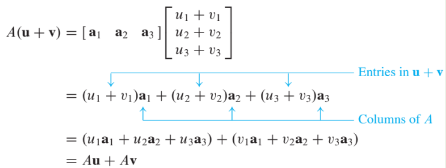
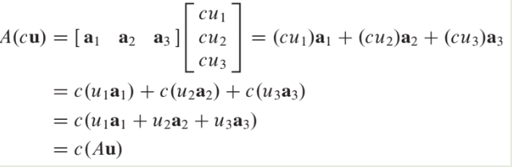

# Linear Equations in Linear Algebra

# 1.4 The Matrix Equation $$A\textbf{x}$$

 A fundamental idea of linear algebra is to view a **linear combination of vectors** as the **product of a matrix and a vector**!!

## Definition

 If $$A$$ is an $$m \times n$$ matrix, with columns $$\textbf{a}_1, \cdots, \bf{a}_n$$, 
and if $$\textbf{x}$$ is in $$\mathbb{R}^n$$, 
then the product of $$A$$ and $$\textbf{x}$$, denoted by $$A\bf{x}$$
 is the linear combination of the columns of $$A$$ using the corresponding entries in $$\textbf{x}$$
as weights; that is,

$$
A\textbf{x} =
\begin{bmatrix}
 & & \\
\textbf{a}_1 & \cdots & \textbf{a}_n\\
 & & \\
\end{bmatrix}
\begin{bmatrix}
x_1 \\ 
\vdots \\
x_n
\end{bmatrix}
=
 x_1 \textbf{a}_1  + x_2 \textbf{a}_2 + \cdots +  x_n \textbf{a}_n
$$

Note that $$A\textbf{x}$$ is defined only if the number of columns
of $$A$$ equals the number of entries in $$\textbf{x}$$. .

## Example 2

For $$\textbf{v}_1, \bf{v}_2, \bf{v}_3$$ in $$\mathbb{R}^m$$, write the linear combination $$3\textbf{v}_1-5\textbf{v}_2+7\textbf{v}_3$$ as a matrix times a vector.

### Solution of Example 2
Place $$\textbf{v}_1, \bf{v}_2, \bf{v}_3$$ into the columns of a matrix $$A$$ and place the weights 3,-5, and 7 into a vector $$\bf{x}$$.
That is,

$$
3\textbf{v}_1-5\textbf{v}_2+7\textbf{v}_3=\begin{bmatrix} \textbf{v}_1 & \textbf{v}_2 & \textbf{v}_3 \end{bmatrix} 
\begin{bmatrix} 3 \\ -5 \\ 7 \end{bmatrix} = A \textbf{x}
$$

$$\blacksquare$$

Now, write the system of linear equations as a vector equation involving a linear combination of vectors.

For examples, the following system

$$
\begin{align}
x_1+2x_2-x_3 &=4 \\
-5x_2 +3 x_3 &=1 
\end{align} \tag{1}
$$

is equivalent to 

$$
x_1 \begin{bmatrix} 1 \\ 0 \end{bmatrix} 
+x_2 \begin{bmatrix} 2 \\ -5 \end{bmatrix} 
+x_3 \begin{bmatrix} -1 \\ 3 \end{bmatrix} 
= \begin{bmatrix} 4 \\ 1 \end{bmatrix} 
\tag{2}
$$

As in the example, the linear combination of the left side is **a matrix times a vector**, so that (2) becomes

$$
\begin{bmatrix} 1 & 2 & -1 \\ 0 & -5 & 3 \end{bmatrix} 
\begin{bmatrix} x_1 \\ x_2 \\ x_3 \end{bmatrix} =
\begin{bmatrix} 4 \\ 1 \end{bmatrix} \tag{3}
$$

Equation (3) has the form $$A\textbf{x}=\bf{b}$$. Such an equation is called a **matrix equation** to distinguish it from a vector equation such as shown in (2).

---

## Theorem 3

If $$A$$ is an $$m \times n$$ matrix, with columns $$\textbf{a}_1, \bf{a}_2, \cdots, \bf{a}_n$$, and if $$\bf{x}$$ is in $$\mathbb{R}^n$$, then the **matrix equation**

$$
A\textbf{x} = \bf{b}
$$

has **the same solution set** as the [**vector equation**](./la_01_03.html).

$$
x_1
\textbf{a}_1 + 
x_2 
\textbf{a}_2 + 
\cdots + 
x_n \textbf{a}_n = \textbf{b}
$$

which, in turn, has **the same solution set** as the systme of linear euqations whose **augmented matrix** is

$$
\begin{bmatrix}
\textbf{a}_1 & \bf{a}_2 & \cdots & \bf{a}_n & \bf{b}
\end{bmatrix}
$$

---

## Existence of Solutions

> * The equation $$A\textbf{x} = \bf{b}$$ has a solution if and only if $$\bf{b}$$ is a linear combination of the columns of $$A$$.

## Theorem 4

Let $$A$$ be an $$m \times n$$ matrix. Then the following statements are logically equivalent. 
That is, for a particular $$A$$, 
either they are all true statements or they are all false.

1. For each $$\textbf{b}$$ in $$\mathbb{R}^m$$, the equation $$A\bf{x}$$ has a solution.
2. Each $$\textbf{b}$$ in $$\mathbb{R}^m$$ is a linear combination of the columns of $$A$$.
3. The columns of $$A$$ span $$\mathbb{R}^m$$
4. $$A$$ has a pivot position in every row.

---

> * Theorem 4 is about a *coefficient matrix*, not an augmented matrix.

## Example 4 : Computation of $$A\textbf{x}$$

Compute $$A\textbf{x}$$, where $$\textbf{A} = \begin{bmatrix} 2 & 3 & 4 \\ -1 & 5 & -3 \\ 6 & -2 & 8 \end{bmatrix}$$ and $$\textbf{x} = \begin{bmatrix}x_1 \\ x_2 \\ x_3 \end{bmatrix}$$.

### Solution of Example 4

From the definition,

$$
\begin{align}
\begin{bmatrix}
2 & 3 & 4 \\
-1 & 5 & -3 \\
6 & -2 & 8
\end{bmatrix}
\begin{bmatrix}
x_1 \\
x_2 \\
x_3 
\end{bmatrix}
&=
x_1
\begin{bmatrix}
2 \\
-1 \\
6 
\end{bmatrix}
+x_2
\begin{bmatrix}
3 \\
5 \\
-2 
\end{bmatrix}
+x_3
\begin{bmatrix}
4 \\
-3 \\
8 
\end{bmatrix}
\\
&=
\begin{bmatrix}
2x_1 \\
-x_1 \\
6x_1 
\end{bmatrix}
+
\begin{bmatrix}
3x_2 \\
5x_2 \\
-2x_2 
\end{bmatrix}
+
\begin{bmatrix}
4x_3 \\
-3x_3 \\
8x_3 
\end{bmatrix}
\\
&=
\begin{bmatrix}
2x_1+3x_2+4x_3 \\
-x_1+5x_2-3x_3 \\
6x_1-2x_2+8x_3
\end{bmatrix}
\end{align}
\tag{1}
$$

The first entry in the product $$A\textbf{x}$$ is a sum of products (sometimes called a **dot** product), 
using the first row of $$A$$ and the entries in $$\textbf{x}$$.

That is,

$$
\begin{bmatrix}
2 & 3 & 4 \\
& & \\
& & 
\end{bmatrix}
\begin{bmatrix}
x_1 \\
x_2 \\
x_3 
\end{bmatrix}
=
\begin{bmatrix}
2x_1+3x_2+4x_3 \\
 \\
 \\
\end{bmatrix}
$$

Similarly, the second entry in $$A\textbf{x}$$
can be calculated
by multiplying the entries in the second row of $$A$$ by the
corresponding entries in $$\textbf{x}$$ and then summing the
resulting products.
$$
\begin{bmatrix}
& & \\
-1&5 &3 \\
& & 
\end{bmatrix}
\begin{bmatrix}
x_1 \\
x_2 \\
x_3 
\end{bmatrix}
=
\begin{bmatrix}
 \\
-x_1+5x_2-3x_3 \\
 \\
\end{bmatrix}
$$

Likewise, the third entry in $$A\textbf{x}$$ can be calculated 
from the third row of $$A$$ and the entries in $$\textbf{x}$$ $$\blacksquare$$.

If the product $$A\textbf{x}$$ is defined, then the $$i$$-th entry in $$A\bf{x}$$
the sum of the products of corresponding entries
from row $$i$$ of $$A$$ and from the vector $$\textbf{x}$$.

## Row-Vector Rule for Computing $$A\textbf{x}$$

The matrix with 1’s on the diagonal and 0’s
elsewhere is called an `identity matrix` and is
denoted by $$I$$.

For example, $$\begin{bmatrix} 1 & 0 & 0 \\ 0 & 1 & 0 \\ 0 & 0 & 1 \end{bmatrix}$$ is an identity matrix.

## Properties of the Matrix-Vector Product $$A\textbf{x}$$

The facts in the next theorem are important and will be used throughout the text.
Think about **Linearity**.

---

## Theorem 5

If $$A$$ is an $$m \times n$$ matrix, $$\textbf{u}$$ and $$\bf{v}$$ are vectors in
$$\mathbb{R}^n$$, and $$c$$ is a scalar, then

1. $$A(\textbf{u} +\bf{v}) = A\bf{u} +A\bf{v} $$

2. $$A(c\textbf{u}) = c(A\textbf{u})$$

### Proof of Theorem 5

For simplicity, take $$n =3$$, $$A = \begin{bmatrix} a_1 & a_2 & a_3 \end{bmatrix} $$,
and $$\textbf{u}$$ and $$\bf{v}$$ in $$\mathbb{R}^3$$.

For $$i=1,2,3$$, let $$u_i$$ and $$v_i$$ be the $$i$$-th entries in $$\textbf{u}$$ and $$\bf{v}$$, respectively.

To prove statement (1), compute $$A(\textbf{u}+\bf{v})$$ 
as a linear combination of the columns of $$A$$ using the entries in
$$\textbf{u} + \bf{v}$$ as weights.

To prove statement (2), compute $$A(c\textbf{u})$$ as a linear combination of the columns of $$A$$
using the entries in $$c\textbf{u}$$ as weights.

$$\blacksquare$$

---
