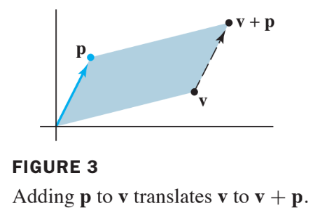

# Linear Equations in Linear Algebra

# 1.5 Solution Sets of Linear Systems

* Solution sets of linear systems are important objects of study in linear algebra.
* This section uses vector notation to give exlicit and geometric descriptions of such solution set.

## Homogeneous Linear Systems

A system of linear equations is said to be **homogeneous**
if it can be written in the form $$A\bf{x}=\bf{0}$$ 
where $$A$$ is an $$m \times n$$ matrix and $$\bf{0}$$ is the zero vector in $$\mathbb{R}^n$$.

Such a system $$A\bf{x}=\bf{0}$$ always has at least one solution, namely, $$\bf{x}=\bf{0}$$ (the zero veoctor in $$\mathbb{R}^n$$).

This zero solution is usually called the **trivial solution**.

For a given homogeneous equation $$A\bf{x}=\bf{0}$$, the important question is whether there exists a **nontrivial solution**, that is, a nonzero vector $$\bf{x}$$ that satisfies $$A\bf{x}=\bf{0}$$.

The [Existence and Unqueness Theorem in Section 1.2 (Theorem)](./la_01_02.html#theorem-2--existence-and-uniqueness-theorem) leads immediately to the following fact.
> The homogeneous equation $$A\bf{x}=\bf{0}$$ has a nontrivial solution if and only if the equation has at least one free variable.

## Example 1: 

Determine if the following homogeneous system has a nontrivial solution. 
Then describe the solution set.

$$
\begin{align}
3x_1+5x_2-4x_3 &=0 \\
-3x_1-2x_2+4x_3 &=0 \\
6x_1+x_2-8x_3 &=0 \\
\end{align}
$$

### Solution fo Example 1

Let $$A$$ be the matrix of coefficients of the system and row reduce the augmented matrix $$\begin{bmatrix}A & \bf{0} \end{bmatrix}$$ to echelon form:

$$
\begin{bmatrix}
3 & 5 & -4 & 0 \\
-3 & -2 & 4 & 0 \\
6 & 1 & -8 & 0 \\
\end{bmatrix}
\sim
\begin{bmatrix}
3 & 5 & -4 & 0 \\
0 & 3 & 0 & 0 \\
0 & -9 & 0 & 0 \\
\end{bmatrix}
\sim
\begin{bmatrix}
3 & 5 & -4 & 0 \\
0 & 3 & 0 & 0 \\
0 & 0 & 0 & 0 \\
\end{bmatrix}
$$

Since $$x_3$$ is a free variable,
has nontrivial solutions (one for each choice of $$x_3$$.)

Continue the row reduction of $$\begin{bmatrix} A & \bf{0} \end{bmatrix}$$ to reduced echelon form:

$$
\begin{bmatrix}
1 & 5/3 & -4/3 & 0 \\
0 & 1 & 0 & 0 \\
0 & 0 & 0 & 0 \\
\end{bmatrix}
\begin{align}
x_1-\frac{4}{3}x_3 &= 0 \\
x_2 &= 0\\
0&=0\\
\end{align}
$$

Solve for the basic variables $$x_1$$ and $$x_2$$ to obtain $$x_1=\frac{4}{3}x_3, x_2=0$$, with $$x_3$$ free.

As a vector, the general solution of $$A\bf{x}=\bf{0}$$ has the form given below.

$$
\textbf{x}=
\begin{bmatrix}
{x_1} \\
{x_2} \\
{x_3} \\ 
\end{bmatrix}
=
\begin{bmatrix}
\frac{4}{3}
{x_3} \\
0 \\
{x_3} \\
\end{bmatrix}
=
{x_3}
\begin{bmatrix}
\frac{4}{3} \\
0 \\
1 \\
\end{bmatrix}
= 
{x_3} 
\textbf{v}
$$

where

$$
\bf{v}= 
\begin{bmatrix}
4/3 \\ 0 \\ 1
\end{bmatrix}
$$

Here $$x_3$$ is factored out of the expression for the general solution vector.

This shows that every solution of $$A\bf{x}=\bf{0}$$ in this case is a scalar multiple of $$\bf{v}$$.

The trivial solution is obtained by choosing $$x_3=0$$

Geometrically, the solution set is a line through $$\bf{0}$$ in $$\mathbb{R}^3$$.

See Fig.1 below.

$$\blacksquare$$

## Parametric Vector Form

The equation of the form $$\textbf{x}= s \textbf{u} + t \textbf{v}$$ ($$s,t$$ in $$\mathbb{R}$$) is called a **parametric vector equation** of the plane.

In Example 1, the equation $$\textbf{x} = x_3 \textbf{v} $$ (with $$x_3$$ free), or $$\textbf{x} = t \textbf{v} $$ (with $$t$$ in $$\mathbb{R}$$),
is a parametric vector equation of a line.

Whenever a solution set is described explicitly
with vectors as in Example 1, we say that the
solution is in **parametric vector form**.

## Solutions of Nonhomogeneous Systems 

 When a nonhomogeneous linear system has many solutions, the general solution can be 
written in parametric vector form as one vector 
plus an arbitrary linear combination of vectors that 
satisfy the corresponding homogeneous system.

## Example 3

Describe all solutions of $$A\bf{x}=\bf{b}$$ where

$$
A = 
\begin{bmatrix}
3 & 5 & -4 \\
-3 & -2 & 4 \\
6 & 1 & -8 
\end{bmatrix}
\text{ and }
\bf{b} =
\begin{bmatrix}
7 \\
-1 \\
-4 
\end{bmatrix}
$$

### Solution of Example 3

Row operations on $$\begin{bmatrix} A & \bf{b}\end{bmatrix} $$ produce

$$
\begin{bmatrix}
3 & 5 & -4 &7 \\
-3 & -2 & 4&-1 \\
6 & 1 & -8&-4 
\end{bmatrix}
\sim
\begin{bmatrix}
1 & 0 & -4/3 &-1 \\
0 & 1 & 0 & 2 \\
0 & 0 & 0 & 0
\end{bmatrix},
\begin{align}
x_1-\frac{4}{3}x_3&=-1 \\
x_2 &= 2 \\
0 &= 0
\end{align}
$$

Thus, $$x_1 = -1 + \frac{4}{3}x_3, x_2=2$$, and $$x_3$$ is free.

As a vector, the general solution of $$A\bf{x}=\bf{b}$$ has the form

The equation $$\textbf{x}=\textbf{p}+x_3\textbf{v}$$, or, writing t as a general parameter,

$$
\textbf{x} = \textbf{p} + t \textbf{v} \quad ( {t} \text{ in } \mathbb{R})
\tag{3}
$$

describes the solution set of $$A\bf{x}=\bf{b}$$ in parametric vector form.

The solution set of $$A\bf{x}=\bf{0}$$ has the parametric vector equation

$$
\textbf{x} = t \textbf{v} \quad ( t \text{ in }  \mathbb{R}) \tag{4}
$$

[with the same $$\bf{v}$$ that appears in (3)]. $$\blacksquare$$

Thus **the solutions of $$A\bf{x}=\bf{b}$$** are obtained 
by **adding the vector $$\bf{p}$$ to the solutions of $$A\bf{x}=\bf{0}$$**.

The vector $$\bf{p}$$ itself is just one **particular solution** of $$A\bf{x}=\bf{b}$$ [corresponding to $$t$$ = 0 in (3).]

To describe the solution of $$A\bf{x}=\bf{b}$$ geometrically, we can think of **vector addition as a translation**.

Given $$\bf{v}$$ and $$\bf{p}$$ in $$\mathbb{R}^2$$ or $$\mathbb{R}^3$$, the effect of adding $$\bf{p}$$ to $$\bf{v}$$ 
is to move $$\bf{v}$$ in a direction parallel to the line through $$\bf{p}$$ and $$\bf{0}$$.

We say that **$$\bf{v}$$ is translated by $$\bf{p}$$ to $$\bf{v}+\bf{p$$**. See the following figure.

If each point on a line $$L$$ in $$\mathbb{R}^2$$ or $$\mathbb{R}^3$$ is translated by 
a vector $$\bf{p}$$, the result is a line parallel to $$L$$. 
See the following figure.

Suppose $$L$$ is the line through $$\bf{0}$$ and $$\bf{v}$$, described by equation (4).

Adding $$\bf{p}$$ to each point on $$L$$ produces the translated line described by equation (3).

We call **(3) the equation of the line through $$\bf{p}$$ parallel to $$\bf{v}$$**.

Thus *the solution set of $$A\bf{x}=\bf{b}$$ is a line through $$\bf{p}$$ parallel to the solution set of $$A\bf{x}=\bf{0}$$*.
The figure below illustrates this case.

**The relation between the solution sets of $$A\bf{x}=\bf{b}$$ and $$A\bf{x}=\bf{0}$$** 
shown in the figure above generalizes to **any consistent equation $$A\bf{x}=\bf{b}$$** 
,although **the solution set will be larger than a line 
when there are several free variables**.

---

## Theorem 6

Suppose the equation $$A\bf{x}=\bf{b}$$ is **consistent** for some given $$\bf{b}$$, 
and let $$\bf{p}$$ be a solution (,it means that $$\bf{p}$$ is a particular solution). 

Then the solution set of $$A\bf{x}=\bf{b}$$ is the **set of all vectors of the form $$\bf{w}=\bf{p}+\bf{v}_h$$**, 
where **$$\bf{v}_h$$ is any solution of the homogeneous equation $$A\textbf{x}=\textbf{0}$$**.

* Theorem 6 says that if $$A\bf{x}=\bf{b}$$ has a solution, then the solution set is obtained by translating the solution set of
  $$A\bf{x}=\bf{0}$$ using any particular solution $$\bf{p}$$ of $$A\bf{x}=\bf{b}$$ for the translation.

## Writing a Solution Set (of a Consistent System) in Parametric Vector Form

1. Row reduce the augmented matrix to **reduced echelon form, RREF**.
2. Express each basic variable in terms of any free variables appearing in an equation.
3. Write a typical solution $$\bf{x}$$ as a vector whose entries depend on the free variables, if any.
4. Decompose $$\bf{x}$$ into a **linear combination of vectors (with numeric entries)** using the free variables as parameters.

$$
\begin{bmatrix}
-1 \\ 2 \\ 0 
\end{bmatrix} +
x_3
\begin{bmatrix}
4/3 \\ 0 \\ 1
\end{bmatrix}
$$

