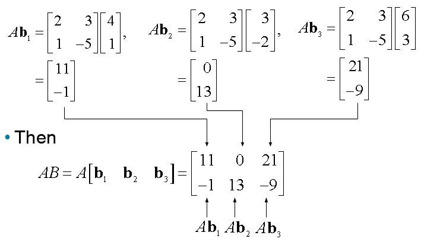

# Ch02. Matrix Algebra

## Matrix Operations

* If $$A$$ is an $$m \times n$$ matrix—that is, a matrix with $$m$$ rows and $$n$$ columns—then the scalar entry in the $$i$$th row and $$j$$th column of $$A$$ is denoted by $$a_{ij}$$ and is called the $$(i,j)$$-entry of $$A$$.
* Each column of $$A$$ is a list of $$m$$ real numbers, which identifies a vector in $$\mathbb{R}^m$$.
* The columns are denoted by $$\textbf{a}_1, \cdots, \textbf{a}_n$$, and the matrix $$A$$ is written as 

$$A=\begin{bmatrix}\textbf{a}_1 & \textbf{a}_2&\cdots&\textbf{a}_n \end{bmatrix}$$

* The number $$a_{ij}$$ is the $$i$$th entry (from the top) of the $$j$$th column vector $$\textbf{a}_j$$.
* The **diagonal entries** in an $$m\times n$$ matrix $$A=[a_{ij}]$$ are $$a_{11},a_{22},\cdots,$$ and they form the **main diagonal** of $$A$$.
* A **diagonal matrix** is a square $$n \times n$$ matrix whose nondiagonal entries are zero.
* An example is the $$n\times n $$ **identity matrix**, $$I_n$$.
* An $$m\times n $$ matrix whose entires are all zero is a **zero matrix** and is writeen as $$0$$.
* The two matrices are **equal** if they have the same size (i.e., the same number of rows and the same number of columns) an if their corresponding columns are equal, which amounts to saying that their corresponding entires are equal.

## Sums and Scalar Multiples

### Sum of Matrices

* If $$A$$ and $$B$$ are $$m\times n$$ matrices, then the **sum** $$A+B$$ is the $$m \times n$$ matrix whose columns are the sums of the corresponding columns in $$A$$ and $$B$$.
* Since vector addition of the columns is done entrywise, each entry in $$A+B$$ is the sum of the corresponding entries in $$A$$ and $$B$$.
* The sum $$A+B$$ is defined only when $$A$$ and $$B$$ are the same size.

### Example 1

Let $$A=\begin{bmatrix} 4 & 0 & 5 \\ -1 & 3 & 2 \end{bmatrix}, B=\begin{bmatrix} 1 & 1 & 1 \\ 3 & 5 & 7 \end{bmatrix}$$, and $$C=\begin{bmatrix} 2 & -3 \\ 0 & 1 \end{bmatrix}$$. Find $$A+B$$ and $$A+C$$.

#### Solution:

* $$A+B=\begin{bmatrix} 5 & 1 & 6 \\ 2 & 8 & 9 \end{bmatrix}$$ but $$A+C$$ is not defined because $$A$$ and $$C$$ have different sizes.

### Scalar Multiple of Matrix

* If $$r$$ is a scalar and $$A$$ is a matrix, then the **scalar multiple** $$r A$$ is the matrix whose columns are $$r$$ times the corresponding columns in $$A$$.

### Theorem 1: Let $$A$$, $$B$$, and $$C$$ be matrices of the same size, and let $$r$$ and $$s$$ be scalars.

1. $$A+B=B+A$$
2. $$(A+B)+C=A+(B+C)$$
3. $$A+0=A$$
4. $$r(A+B)=rA+rB$$
5. $$(r+s)A=rA+sA$$
6. $$r(sA)=(rs)A$$

* Each quantity in Theorem 1 is verified by showing that the matrix on the left side has the same size as the matrix on the right and that corresponding columns are equal.

## Matrix Multiplication

* When a matrix $$B$$ multiplies a vector $$\textbf{x}$$, it transforms $$\textbf{x}$$ 
  into the vector $$B \textbf{x}$$.
* If this vector is then multiplied in turn by a matrix $$A$$, 
  the resulting vector is $$A(B\textbf{x})$$. See the Fig. 2 below.

* If $$A$$ is $$m\times n$$, $$B$$ is $$n\times p$$, and $$\textbf{x}$$ is in $$\mathbb{R}^p$$, denote the columns of $$B$$ by $$\textbf{b}_1,\cdots,\textbf{b}_p$$ and the entries in $$\textbf{x}$$ by $$x_1,\cdots,x_p$$.
* Then $$B\textbf{x}=x_1\textbf{b}_1+\cdots+x_p\textbf{b}_p$$.
* By the linearity of multiplication by $$A$$,
$$
\begin{align}
A(B\textbf{x})&=A(x_1\textbf{b}_1)+\cdots+A(x_p\textbf{b}_p) \\
&=x_1A\textbf{b}_1+\cdots+x_pA\textbf{b}_p
\end{align}
$$
* The vector $$A(B\textbf{x})$$ is a linear combination of the vectors $$A\textbf{b}_1,\cdots,A\textbf{b}_p$$, 
  using the entries in $$\textbf{x}$$ as weights.
* In matrix notation, this linear combination is written as
$$
A(B\textbf{x})=\begin{bmatrix} A\textbf{b}_1 & A\textbf{b}_2 & \cdots & A\textbf{b}_p \end{bmatrix} \textbf{x}
$$
* Thus multiplication by $$\begin{bmatrix}A\textbf{b}_1 & A\textbf{b}_2 & \cdots & A\textbf{b}_p \end{bmatrix}$$ transforms $$\textbf{x}$$ into $$A(B\textbf{x})$$.

### Definition

If $$A$$ is an $$m \times n$$ matrix, and if $$B$$ is an $$n \times p$$ matrix with columns $$ \textbf{b}_1,\cdots,\textbf{b}_p$$, then the product $$A B$$ is the $$m \times p$$ matrix whose columns are $$A \textbf{b}_1, \cdots, A \textbf{b}_p$$.

That is,
$$AB = A\begin{bmatrix}\textbf{b}_1 &\cdots & \textbf{b}_p \end{bmatrix} =\begin{bmatrix} A \textbf{b}_1 &\cdots & A \textbf{b}_p\end{bmatrix}$$

**Multiplication of matrices corresponds to composition of linear transformations.**

### Example 3

Compute $$A B$$, where $$A=\begin{bmatrix}2&3\\1&-5\end{bmatrix}$$ and $$B=\begin{bmatrix}4&3&6\\1&-2&3\end{bmatrix}$$.

#### Solution: 
Write $$B=\begin{bmatrix}\textbf{b}_1,\textbf{b}_2,\textbf{b}_3\end{bmatrix}$$, and, compute:

* Each column of $$A B$$ is a **linear combination of the columns of $$A$$** using weights from the corresponding column of $$B$$.

### Row—column rule for computing A B

If a product $$A B$$ is defined, then the entry in row $$i$$ and column $$j$$ of $$A B$$ is the sum of the products of corresponding entries from row $$i$$ of $$A$$ and column $$j$$ of $$B$$. If $$(AB)_{ij}$$ denotes the $$(i, j)$$-entry in $$A B$$, and if $$A$$ is an $$m \times n$$ matrix, then
$$
(AB)_{ij}=a_{i1}b_{1j}+a_{i2}b_{2j}+\cdots+a_{in}b_{nj}
$$

### Properties of Matrix Multiplication

#### Theorem 2:

Let $$A$$ be an $$m \times n$$ matrix, and let $$B$$ and $$C$$ have sizes for which the indicated sums and products are defined.

1. $$A(BC)=(AB)C$$ (associative law of multiplication)
2. $$A(B+C)=AB+AC$$ (left distributive law)
3. $$(B+C)A=BA+CA$$ (right distributive law)
4. $$r(AB)=(rA)B =A(rB)$$ for any scalar $$r$$.
5. $$I_mA=A=AI_n$$ (identity for matrix multiplication)

### Warnings:
1. In general, $$AB \ne BA$$.
2. **The cancellation laws do not hold for matrix multiplication**. That is, if $$AB=AC$$, then it is not true in general that $$B=C$$.
3. If a product $$A B$$ is the zero matrix, you cannot conclude in general that either $$A = 0$$ or $$B = 0$$.

## Powers of a Matrix

* If $$A$$ is an $$n \times n$$ matrix and if $$k$$ is a positive integer, then $$A^k$$ denotes the product of $$k$$ copies of $$A$$:
$$
A^k = \underbrace{ A \cdots A }_{k}
$$

* If $$A$$ is nonzero and if $$\textbf{x}$$ is in $$\mathbb{R}^n$$, then $$A^k \textbf{x}$$ is the result of left-multiplying $$\textbf{x}$$ by $$A$$ repeatedly $$k$$ times.
* If $$k = 0$$, then $$A^0\textbf{x}$$ should be $$\textbf{x}$$ itself.
* Thus $$A^0$$ is interpreted as the identity matrix.

## The Transpose of a Matrix

* Given an $$m \times n$$ matrix $$A$$, the **transpose** of $$A$$ is the $$n \times m$$ matrix, denoted by $$A^T$$ whose columns are formed from the corresponding rows of $$A$$.

### Theorem 3:

Let $$A$$ and $$B$$ denote matrices whose sizes are appropriate for the following sums and products.

1. $$(A^T)^T=A$$
2. $$(A+B)^T = A^T+B^T$$
3. For an scalar $$r$$, $$(rA)^T=rA^T$$
4. **$$(AB)^T =B^T A^T$$**

The **transpose of a product** of metrices equals the product of their transposes in the reverse order.
