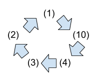
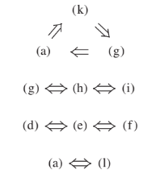
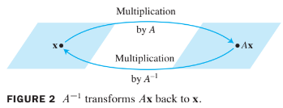

# Ch02. Matrix Algebra

# 2.3 Characterizations of Invertible Matrices

## The Invertible Matrix Theorem

---

## Theorem 8

Let $$A$$ be a square $$ n \times n $$matrix. 
Then the following statements are **equivalent**. 
That is, for a given $$A$$, the statements are either all true or all false.

1. $$A$$ is an **invertible matrix**.
2. $$A$$ is row equivalent to the identity matrix.
3. $$A$$ has $$n$$ pivot positions.
4. The equation $$A \textbf{x}=\textbf{0}$$ has only the trivial solution.
5. The columns of $$A$$ form **a linearly independent set**.
6. The linear transformation $$\textbf{x} \mapsto A\textbf{x}$$ is one-to-one.
7. The equation $$A \textbf{x}=\textbf{b}$$ has at least one solution for each $$\textbf{b}$$ in $$\mathbb{R}^n$$.
8. The columns of $$A$$ span $$\mathbb{R}^n$$.
9. The linear transformation $$\textbf{x} \mapsto A\textbf{x}$$ maps $$\mathbb{R}^n$$ onto $$\mathbb{R}^n$$.
10. There is an $$n \times n$$ matrix $$C$$ such that $$ CA=I$$.
11. There is an $$n \times n$$ matrix $$D$$ such that $$ AD=I$$.
12. $$A^T$$ is an invertible matrix.

* First, we need some notation.
* If the truth of statement (1) always implies that statment (10) is true, we say that (1) implies (10) and write $$(1) \Rightarrow (10)$$.
* The proof will establish the "circle" of implications as shown in the following figure.

 

* If any one of these five statements is true, then so are the others.
* Finally, the proof will link the remaining statements of the theorem to the statements in this circle.

### Proof:

If statement (1) is true, then $$ A^{-1}$$ works for $$C$$ in (10), so $$(1) \Rightarrow (10)$$.

Next, $$(10) \Rightarrow (4)$$.

Also, $$(4) \Rightarrow (3)$$.

If $$A$$ is square and has $$n$$ pivot positions, then the pivots must lie on the main diagonal, in which case the reduced echelon form of $$A$$ is $$I_n$$. Thus $$(3) \Rightarrow (2)$$.

Also, $$(2) \Rightarrow (1)$$.

This completes the circle in the previous figure.

Next, $$(1) \Rightarrow (11)$$ because $$A^{-1}$$ works for $$D$$.

Also, $$(11) \Rightarrow (7)$$ and $$(7) \Rightarrow (1)$$.

So, $$(11)$$ and $$(7)$$ are linked to the circle.

Further, $$(11), (8),$$ and $$(9)$$ are equivalent for any matrix.

Thus, $$(8)$$ and $$(9)$$ are linked through $$(11)$$ to the circle.

Since $$(4)$$ is linked to the circle, so are $$(5)$$ and $$(6)$$, because $$(4)$$, $$(5)$$, and $$(6)$$ are all equivalent for any matrix $$A$$.

Finalyy, $$(1) \Rightarrow (12)$$ and $$(12) \Rightarrow (1)$$.

This completes the proof. $$\blacksquare$$

 

---

**Theorem 8** could also be written as 

**The equation $$A\textbf{x} =\textbf{b}$$ has a unique solution for each $$\textbf{b}$$ in $$\mathbb{R}^n$$.**

* This statement implies (2) and hence implies that $$A$$ is invertible.
* The following fact follows from **Theorem 8**. Let $$A$$ and $$B$$ be square matrices. If $$AB=I$$, then $$A$$ and $$B$$ are both invertible, with $$B=A^{-1}$$ and $$A=B^{-1}$$.
* The **Invertible Matrix Theorem** divides the set of all $$n \times n$$ matrices into two disjoint classes:
  * the invertible (nonsingular) matrices, and
  * the noninvertible (singular) matrices.
* Each statement in the theorem describes a property of every $$n \times n$$ invertible matrix.
* The negation of a statement in the theorem describes a property of every $$n \times n$$ singular matrix.
* For instance, an $$n \times n$$ singular matrix  
  * is not row equivalent to $$I_n$$, 
  * does not have $$n$$ pivot position, and
  * has linearly dependent columns.

## Example 1:

Use the Invertible Matrix Theorem to decide if $$A$$ is invertible:

$$
A=
\begin{bmatrix}
1 & 0 & -2 \\
3 & 1 & -2 \\
-5 & -1 & 9 
\end{bmatrix}
$$

### Solution:

$$
A \sim
\begin{bmatrix}
1 & 0 & -2 \\
0 & 1 & 4 \\
0 & -1 & -1 
\end{bmatrix}
\sim
\begin{bmatrix}
1 & 0 & -2 \\
0 & 1 & 4 \\
0 & 0 & 3 
\end{bmatrix}
$$

* So $$A$$ has three pivot positions and hence is invertible, 
  by the Invertible Matrix Theorem, statement (3).
* The Invertible Matrix Theorem applies only to square matrices.
* For example, 
  if the columns of a $$4 \times 3$$ matrix are **linearly independent**, 
  we cannot use the Invertible Matrix Theorem 
  to conclude anything about the existence or nonexistence 
  of solutions of equation of the form $$A\textbf{x}=\textbf{b}$$.

## Invertible Linear Transformations

* **Matrix multiplication** corresponds to **composition of linear transformations**.
* When a matrix $$A$$ is invertible, 
  the equation $$A^{-1}A\textbf{x}=\textbf{x}$$ can be viewed as 
  a statement about **linear transformations**. See the following figure.

 

* A linear transformation $$T: \mathbb{R}^n \rightarrow \mathbb{R}^n$$ is said to be invertible 
  if there exists a function $$S: \mathbb{R}^n \rightarrow \mathbb{R}^n$$ such that

  * $$S(T(\textbf{x})) = \textbf{x}$$ for all $$\textbf{x}$$ in $$\mathbb{R}^n$$. (1)
  * $$T(S(\textbf{x})) = \textbf{x}$$ for all $$\textbf{x}$$ in $$\mathbb{R}^n$$. (2)

---

## Theorem 9: 

Let $$T: \mathbb{R}^n \rightarrow \mathbb{R}^n$$ be a linear transformation and 
let $$A$$ be the standard matrix for $$T$$. 
Then $$T$$ is invertible if and only if 
$$A$$ is an invertible matrix. 
In that case, the linear transformation $$S$$ given by 
$$S(\textbf{x})=A^{-1}\textbf{x}$$ is the **unique function** satisfying equation (1) and (2).

### Proof :

* Suppose that $$T$$ is invertible.
* Then (2) shows that $$T$$ is onto $$\mathbb{R}^n$$, for if $$\bf{b}$$ is in $$\mathbb{R}^n$$ and
  $$\textbf{x}=S(\textbf{b})$$, then $$T(\textbf{x})=T(S(\textbf{b}))=\textbf{b}$$,
  so each $$\textbf{b}$$ is in the range of $$T$$.
* Thus $$A$$ is invertible, by the Invertible Matrix Theorem, statement (9).
* Conversely, suppose that $$A$$ is invertible, and let $$S(\textbf{x})=A^{-1}\textbf{x}$$.
* Then, $$S$$ is a linear transformation, and $$S$$ satisfies (1) and (2).
* For instance, $$S(T(\textbf{x})) = S(A\textbf{x})=A^{-1}(A\textbf{x})=\textbf{x}$$.
* Thus, $$T$$ is invertible.
