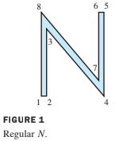
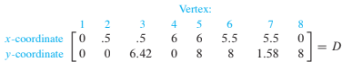
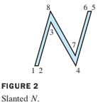
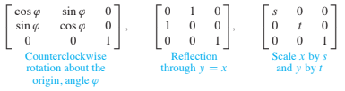

# 2.7 Applications to Computer Graphics

* Computer graphics are images displayed or animated on a computer screen. 
* Applications of computer graphics are widespread and growing rapidly. 
* For instance, **computer aided design (CAD)** is an integral part of many engineering processes.

Most interactive computer software for business and industry makes use of computer graphics 
in the screen displays and for other functions, such as 
* graphical display of data, 
* desktop publishing, and 
* slide production for commercial and educational presentations. 

Consequently, anyone studying a computer language invariably spends time
learning how to use at least two-dimensional (2D) graphics.

This section examines some of the basic mathematics 
used to manipulate and display graphical images.
* Often, curved lines are approximated by short straight-line segments, and 
* a figure is defined mathematically by **a list of points**.

## EXAMPLE 1 

The capital letter **N** in Figure 1 is determined by eight points, or
vertices. The coordinates of the points can be stored in a data matrix, $$D$$.

In addition to $$D$$, 
it is necessary to specify which vertices are connected by lines, but we omit this detail.

---

The main reason graphical objects are described by 
collections of straight-line segments is that 
the standard transformations in computer graphics 
**map line segments onto other line segments**.

Once the vertices that describe an object have been transformed, their images can be connected with the
appropriate straight lines to produce the complete image of the original object.

## EXAMPLE 2 

Given $$A=\begin{bmatrix} 1 & .25 \\ 0 & 1 \end{bmatrix}$$, 
describe the effect of the shear transformation 
$$\textbf{x} \mapsto A\textbf{x}$$ on the letter $$N$$ in Example 1.

### Solution 

By definition of matrix multiplication, the columns of the product AD
contain the images of the vertices of the letter N.

$$
\displaystyle AD = \left[\begin{matrix}0 & 0.5 & 2.105 & 6 & 8.0 & 7.5 & 5.895 & 2.0\\0 & 0 & 6.42 & 0 & 8 & 8 & 1.58 & 8\end{matrix}\right]
$$

The transformed vertices are plotted in Figure 2, along with connecting line segments
that correspond to those in the original figure.

---

The mathematics of computer graphics is intimately connected with matrix multiplication. 
Unfortunately, **translating an object** on a screen does not correspond directly
to **matrix multiplication** 
because *translation is not a linear transformation*. 
The standard way to avoid this difficulty is to introduce what are called **homogeneous coordinates**.

## Homogeneous Coordinates

Each point $$(x,y)$$ in $$\mathbb{R}^2$$ 
can be identified with the point $$(x,y,1)$$ on the plane in $$\mathbb{R}^3$$
that lies one unit above the $$xy$$-plane. 

We say that $$(x,y)$$ has ***homogeneous coordinates*** $$(x, y, 1)$$. 
* For instance, the point (0, 0) has homogeneous coordinates (0, 0, 1). 

** Homogeneous coordinates for points** are not added or multiplied by scalars, 
but they can be transformed via multiplication by $$3 \times  3$$ matrices.

### Translation

In homogeneous coordiantes, the translation can be computed via matrix multiplication:

$$
\left[\begin{matrix}1 & 0 & h\\0 & 1 & k\\0 & 0 & 1\end{matrix}\right]
\begin{bmatrix}x \\y \\ 1\end{bmatrix} = 
\begin{bmatrix}x+h \\y+k \\ 1\end{bmatrix} 
$$

## Example 5

Any linear transformation on $$\mathbb{R}^2$$ is represented with respect to 
homogeneous coordinates by a partitioned matrix of the form $$\begin{bmatrix}A & 0 \\ 0 & 1\end{bmatrix}$$,
, where $$A$$ is a $$2\times 2$$ matrix.
Typical examples are

