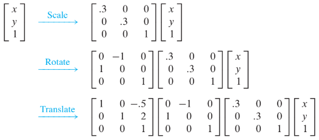

# 2.7 Applications to Computer Graphics

* Computer graphics are images displayed or animated on a computer screen. 
* Applications of computer graphics are widespread and growing rapidly. 
* For instance, **computer aided design (CAD)** is an integral part of many engineering processes.

Most interactive computer software for business and industry makes use of computer graphics 
in the screen displays and for other functions, such as 
* graphical display of data, 
* desktop publishing, and 
* slide production for commercial and educational presentations. 

Consequently, anyone studying a computer language invariably spends time
learning how to use at least two-dimensional (2D) graphics.

This section examines some of the basic mathematics 
used to manipulate and display graphical images.
* Often, curved lines are approximated by short straight-line segments, and 
* a figure is defined mathematically by **a list of points**.

## EXAMPLE 1 

The capital letter **N** in Figure 1 is determined by eight points, or
vertices. The coordinates of the points can be stored in a data matrix, $$D$$.

In addition to $$D$$, 
it is necessary to specify which vertices are connected by lines, but we omit this detail.

---

The main reason graphical objects are described by 
collections of straight-line segments is that 
the standard transformations in computer graphics 
**map line segments onto other line segments**.

Once the vertices that describe an object have been transformed, their images can be connected with the
appropriate straight lines to produce the complete image of the original object.

## EXAMPLE 2 

Given $$A=\begin{bmatrix} 1 & .25 \\ 0 & 1 \end{bmatrix}$$, 
describe the effect of the shear transformation 
$$\textbf{x} \mapsto A\textbf{x}$$ on the letter $$N$$ in Example 1.

### Solution 

By definition of matrix multiplication, the columns of the product AD
contain the images of the vertices of the letter N.

$$
\displaystyle AD = \left[\begin{matrix}0 & 0.5 & 2.105 & 6 & 8.0 & 7.5 & 5.895 & 2.0\\0 & 0 & 6.42 & 0 & 8 & 8 & 1.58 & 8\end{matrix}\right]
$$

The transformed vertices are plotted in Figure 2, along with connecting line segments
that correspond to those in the original figure.

---

The mathematics of computer graphics is intimately connected with matrix multiplication. 
Unfortunately, **translating an object** on a screen does not correspond directly
to **matrix multiplication** 
because *translation is not a linear transformation*. 
The standard way to avoid this difficulty is to introduce what are called **homogeneous coordinates**.

## Homogeneous Coordinates

Each point $$(x,y)$$ in $$\mathbb{R}^2$$ 
can be identified with the point $$(x,y,1)$$ on the plane in $$\mathbb{R}^3$$
that lies one unit above the $$xy$$-plane. 

We say that $$(x,y)$$ has ***homogeneous coordinates*** $$(x, y, 1)$$. 
* For instance, the point (0, 0) has homogeneous coordinates (0, 0, 1). 

** Homogeneous coordinates for points** are not added or multiplied by scalars, 
but they can be transformed via multiplication by $$3 \times  3$$ matrices.

### Translation

In homogeneous coordiantes, the translation can be computed via matrix multiplication:

$$
\left[\begin{matrix}1 & 0 & h\\0 & 1 & k\\0 & 0 & 1\end{matrix}\right]
\begin{bmatrix}x \\y \\ 1\end{bmatrix} = 
\begin{bmatrix}x+h \\y+k \\ 1\end{bmatrix} 
$$

## Example 5

Any linear transformation on $$\mathbb{R}^2$$ is represented with respect to 
homogeneous coordinates by a partitioned matrix of the form $$\begin{bmatrix}A & 0 \\ 0 & 1\end{bmatrix}$$,
where $$A$$ is a $$2\times 2$$ matrix.
Typical examples are

## Composite Transformations

* The movement of a figure on a computer screen often requires 
two or more basic transformations. 
* The **composition** of such transformations corresponds to 
  **matrix multiplication** when **homogeneous coordinates are used**.

## EXAMPLE 6 

Find the $$3 \times 3$$ matrix that corresponds to the composite 
transformation of a scaling by .3, a rotation of $$\ang{90}$$
about the origin, and finally a translation that
adds (5, 2) to each point of a figure.

### Solution

If $$\phi = \pi/2$$, then $$\sin{\phi}=1$$ and $$\cos{\phi}=0$$. From Examples 4 and 5, we
have

The matrix for the composite transformation is

$$
\begin{bmatrix}
1 & 0 & -.5 \\
0 & 1 & 2 \\
0 & 0 & 1
\end{bmatrix}
\begin{bmatrix}
0 & -1 & 0\\
1 & 0 & \\
0 & 0 & 1
\end{bmatrix}
\begin{bmatrix}
.3 & 0 & 0 \\
0 & .3 & 0 \\
0 & 0 & 1
\end{bmatrix}
=
\begin{bmatrix}
0 & -1 & -.5 \\
1 & 0 & 2 \\
0 & 0 & 1
\end{bmatrix}
\begin{bmatrix}
.3 & 0 & 0 \\
0 & .3 & 0 \\
0 & 0 & 1
\end{bmatrix}
=
\begin{bmatrix}
0 & -.3 & -.5\\
.3 & 0 & 2\\
0 & 0 & 1\\
\end{bmatrix}
$$

## Homogeneous 3D Coordinates

By analogy with the 2D case, we say that $$(x, y, z, 1)$$ are homogeneous coordinates for
the point $$(x, y, z)$$ in $$\mathbb{R}^3$$.
In general, $$(X, Y, Z, H)$$ are homogeneous coordinates for $$(x, y, z)$$
if $$H \ne 0$$ and

$$
\begin {align}
x &= \frac{X}{H}\\
y &= \frac{Y}{H}\\
z &= \frac{Z}{H}
\end {align}
$$

* Each nonzero scalar multiple of $$(x, y, z, 1)$$ gives a set of homogeneous coordinates
  for $$(x, y, z)$$ 
* For instance, both (10,-6,14, 2) and (-15, 9,-21,-3) are homogeneous
  coordinates for (5,-3,7).

## EXAMPLE 7 :
Give $$4\times 4$$ matrices for the following transformations:

a. Rotation about the y-axis through an angle of $$\ang{30}$$. 
   (By convention, a positive angle is the counterclockwise direction 
   when looking toward the origin from 
   the positive half of the axis of rotation—in this case, the y-axis.)
b. Translation by the vector $$\textbf{p}=(-6,4,5)$$.

### Solution

#### a.

First, construct the $$3 \times 3$$ matrix for the rotation. 
The vector $$\textbf{e}_1$$ rotates down toward the negative $$z$$-axis, stopping at $$(\cos{\ang{30}},0,-\sin{\ang{30}}) = (\sqrt{3}/2,0,-.5)$$.
The vector $$\textbf{e}_2$$ on the $$y$$-axis does not move, 
but $$\textbf{e}_3$$ on the $$z$$-axis rotates down toward the positive
$$x$$-axis, stopping at $$(\sin{\ang{30}},0,\cos{\ang{30}}) = (.5,0,\sqrt{3}/2)$$
See Figure 5. From Section 1.9, the stardard matrix for this rotation is 

$$
\begin{bmatrix}
\sqrt{3}/2 & 0 & .5 \\
0 & 1 & 0 \\
-.5 & 0 & \sqrt{3}/2 
\end{bmatrix}
$$

So the rotation matrix for homogeneous coordinates is

$$
A=\begin{bmatrix}
\sqrt{3}/2 & 0 & .5 &0\\
0 & 1 & 0 &0\\
-.5 & 0 & \sqrt{3}/2 &0 \\
0 & 0 & 0 & 1 
\end{bmatrix}
$$

#### b.

We want $$(x, y, z, 1)$$ to map to $$(x-6, y+4, z+5, 1)$$. The matrix that does this is

$$
\begin{bmatrix}
1 & 0 & 0 &-6 \\
0 & 1 & 0 & 4 \\
0 & 0 & 1 & 5 \\
0 & 0 & 0 & 1 
\end{bmatrix}
$$

## Perspective Projections

