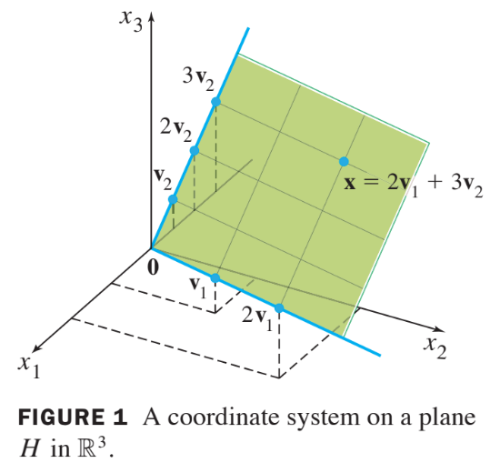

# Ch02 Matrix Algebra

# 2.9 Dimension and Rank

## Coodinate Systems

* Suppose $$B=\left\{ \bf{b}_1, \cdots, \bf{b}_p \right\}$$ is a basis for $$H$$, and suppose a 
  vector $$\textbf{x}$$ in $$H$$ can be generated in two ways, say,

$$
\textbf{x} = c_1 \textbf{b}_1 +\cdots + c_p \textbf{b}_p
\text{ and }
\textbf{x} = d_1 \textbf{b}_1 +\cdots + d_p \textbf{b}_p
\tag{1}
$$

* Then, subtracting gives

$$
\textbf{0} = \textbf{x}-\textbf{x} = (c_1-d_1)\textbf{b}_1 + \cdots +(c_p-d_p)\textbf{b}_p \tag{2}
$$

* Since $$B$$ is linearly independent, the weights in (2) must all be zero. 
* That is, $$c_j = d_j $$ for $$i \le j \le p$$, which shows that the two representations in (1) are actually the
same.

## Definition : Coordinate Vector

Suppose the set $$B=\left\{ \bf{b}_1, \cdots, \bf{b}_p \right\}$$
is a basis for a subspace $$H$$. For each $$\textbf{x}$$ in $$H$$, 
**the coordinates of $$\textbf{x}$$ relative to the basis $$B$$**
are the weights $$c_1, \cdots, c_p$$ such that $$\textbf{x} = c_1 \textbf{b}_1 +\cdots + c_p \textbf{b}_p$$,
and the vector in $$\mathbb{R}^p$$

$$
[\textbf{x}]_B = \begin{bmatrix}
c_1 \\ \vdots \\ c_p \end{bmatrix}
$$

is called the **coordinate vector of x (relative to $$B$$)** or
the **$$B$$-coordinate vector of x**.

## Example 1

Let $$\textbf{v}_1=\begin{bmatrix}3 \\ 6\\ 2 \end{bmatrix}$$,
$$\textbf{v}_2=\begin{bmatrix}-1 \\ 0\\ 1 \end{bmatrix}$$,
$$\textbf{x}=\begin{bmatrix}3 \\ 12\\ 7 \end{bmatrix}$$, and
$$B=\left\{ \bf{v}_1, \bf{v}_2 \right\}$$. Then $$B$$ is a basis for $$H= \text{Span }\left\{ \bf{v}_1, \bf{v}_2 \right\}$$ because $$\textbf{v}_1$$ and $$\textbf{v}_2$$ are linearly independent.
Determine if $$\bf{x}$$ is in $$H$$, and if it is , find the coordinate vector of $$\bf{x}$$ relative to $$B$$.

## Solution

* If $$\bf{x}$$ is in $$H$$, then the following vector equation is consistent:

$$
c_1 \begin{bmatrix}
3\\
6\\
2 
\end{bmatrix} + c_2 = 
\begin{bmatrix}
-1 \\ 0 \\ 1 
\end{bmatrix} = 
\begin{bmatrix}
3 \\ 12 \\ 7 
\end{bmatrix}
$$

* The scalars $$c_1$$ and $$c_2$$, if they exist, are the $$B$$-coordinates 
  of $$\textbf{x}$$. Row operations show that

$$
\begin{bmatrix}
3 & -1 & 3 \\
6 & 0 & 12 \\
2 & 1 & 7
\end{bmatrix}
\sim
\begin{bmatrix}
1 & 0 & 2 \\
0 & 1 & 3 \\
0 & 0 & 0
\end{bmatrix}
$$

* Thus $$c_1=2, c_2=3$$ and $$[\textbf{x}]_B= \begin{bmatrix}2 \\3 \end{bmatrix}$$. 
* The basis $$B$$ determines a “coordinate system” on $$H$$, which can
  be visualized by the grid shown in Fig. 1 below.

## Definition: Dimension

The **dimension** of a nonzero subspace $$H$$, denoted by dim $$H$$, 
is the number of vectors in any basis for $$H$$. 
The dimension of the zero subspace $${\textbf{0} }$$ is defined to be zero.

## Definition: Rank

The **rank** of a matrix $$A$$, denoted by rank $$A$$,
is the dimension of the column space of $$A$$.

## Example 3 :
Determine the rank of the matrix

$$
A \sim 
\begin{bmatrix}
2 & 5 & -3 & -4 & 8 \\
0 & -3 & 2 & 5 & -7 \\
0 & -6 & 4 & 14 & -20 \\
0 & -9 & 6 & 5 & -6
\end{bmatrix}
$$

### Solution : 
Reduce $$A$$ to echelon form :

* The matrix $$A$$ has 3 pivot columns, so rank $$A$$ = 3.

## Theorem 14 :

If a matrix $$A$$ has $$n$$ columns, then rank $$A$$ + dim $$\text{Nul }A = n$$.

## Theorme 15 :

Let $$H$$ be a $$p$$-dimensional subspace of $$\mathbb{R}^n$$.
Any linearly independent set of exactly $$p$$ elements in
$$H$$ is automatically a basis for $$H$$. 
Also, any set of $$p$$ elements of $$H$$ that spans $$H$$ is automatically a basis
for $$H$$.

## Theorem : The Invertible Theorem (continued) :

Let $$A$$ be an $$n \times n$$ square matrix. 
Then the following statements are each equivalent to the statement that $$A$$ is an invertible
matrix.

* 13. The columns of $$A$$ form a basis of $$\mathbb{R}^n$$
* 14. $$\text{Col }A = \mathbb{R}^n$$
* 15. dim $$\text{Col }A = n$$
* 16. rank $$A = n$$
* 17. $$\text{Nul }A = \left\{\textbf{0}\right\}$$
* 17. dim $$\text{Nul }A = 0$$

### Proof

* Statement (13) is logically equivalent to
  statements (5) and (8) 
  regarding linear independence and spanning. 
* The other five statements are linked to the earlier ones of the theorem 
  by the following chain of almost trivial implications:
$$
(7) \Rightarrow (14) \Rightarrow (15) \Rightarrow (16) \Rightarrow (18) \Rightarrow (17) \Rightarrow (4)
$$
* Statement (7), which says that the equation $$A\textbf{x}=\textbf{b}$$
  has at least one solution for each $$\bf{b}$$ in $$\mathbb{R}^n$$, 
  implies statement (14), because $$\text{Col }A$$ is precisely the set of all 
  $$\textbf{b}$$ such that the equation $$A\textbf{x}=\textbf{b}$$ is consistent.
* The implications $$(14) \Rightarrow (15) \Rightarrow (16)$$ follow from the definitions of dimension and rank.
* If the rank of $$A$$ is $$n$$, the number of columns of $$A$$, then
  dim $$\text{Nul }A = 0$$, by the **Rank Theorem**, and 
  so $$\text{Nul }A= \left\{\textbf{0}\right\}$$.
  Thus $$(16) \Rightarrow (18) \Rightarrow (17)$$.
* Also, statement (17) implies that the equation $$A\textbf{x}=\textbf{0}$$
  has only the trivial solution, which is statement (4).
* Since statements (4) and (7) are already known to be equivalent to the 
  statement that $$A$$ is invertible, the proof is complete.

