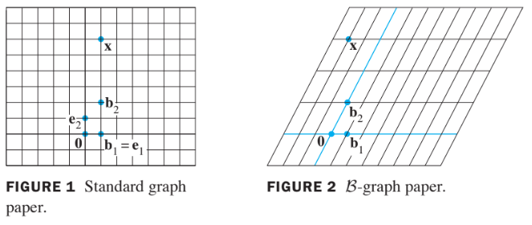
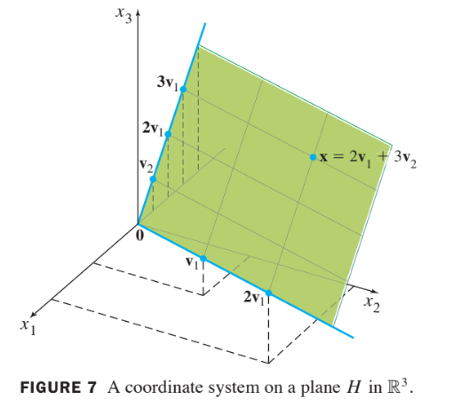

# Vector Spaces

# 4.4 Coordinae Systems

## Theorem 7: The Unique Reresentation Theorem

Let $$B=\left\{ \textbf{b}_1, \cdots, \textbf{b}_n \right\}$$
be a basis for
vector space $$V$$. Then for each $$\textbf{x}$$ in $$V$$, there exists
**a unique set** of scalars $$c_1, \cdots, c_n$$
such that

$$
\textbf{x} = c_1 \textbf{b}_1 + \cdots + c_n\textbf{b}_n \tag{1}
$$

### Proof: 
* Since $$B$$ spans $$V$$, there exist scalars such that (1) holds.
* Suppose $$\textbf{x}$$ also has the representation

$$
\textbf{x} = d_1 \textbf{b}_1 + \cdots + d_n\textbf{b}_n 
$$

for scalars $$d_1, \cdots, d_n$$.

* Then, subtracting, we have

$$
\textbf{0} = \textbf{x}- \textbf{x} = (c_1-d_1)\textbf{b}_1 + \cdots +(c_n-d_n)\textbf{b}_n \tag{2}
$$

* Since $$B$$ is linearly independent, the weights in (2)
  must all be zero. That is, $$c_j = d_j$$ for $$1\le j\le n$$.

## Definition: 

* Suppose $$B=\left\{ \textbf{b}_1, \cdots, \textbf{b}_n \right\}$$
  is a basis for $$V$$ and $$\textbf{x}$$ is in $$V$$. 
* **The coordinates of $$\textbf{x}$$ relative to the basis $$B$$** 
  (or the **$$B$$-coordinate of $$\textbf{x}$$** ) are the weights 
  $$c_1, \cdots, c_n$$ such that $$\textbf{x} = c_1\textbf{b}_1 + \cdots + c_n \textbf{b}_n$$.
* If $$c_1, \cdots,c_n$$ are the $$B$$**-coordinates of** $$\textbf{x}$$, 
  then the vector in $$\mathbb{R}^n$$

$$
[\textbf{x}]_B = \begin{bmatrix} c_1 \\ \vdots \\ c_n \end{bmatrix} 
$$

  is the **coordinate vector of $$\textbf{x}$$ (relative to $$B$$)**, or
  the **$$B$$-coordinate vector of $$\textbf{x}$$.

* The mapping $$\textbf{x} \mapsto [\textbf{x}]_B$$
  is the coordinate mapping (determined by $$B$$).

* When a basis $$B$$ for $$\mathbb{R}^n$$ is fixed, 
  the $$B$$-coordinate vector of a specified $$\textbf{x}$$ 
  is easily found, as in the example below.

## Example 1: 

Let $$\textbf{b}_1 = \begin {bmatrix} 1 \\ 0 \end{bmatrix}, 
\textbf{b}_2 = \begin{bmatrix} 1 \\ 2 \end{bmatrix},
\textbf{x} = \begin{bmatrix} 1 \\ 6 \end{bmatrix}$$, and $$B=\left\{ \textbf{b}_1, \textbf{b}_2 \right\}$$.
Find the coordinate vector $$[\textbf{x}]_B$$ 
of $$\textbf{x}$$
relative to $$B$$.

### Solution: 

* The $$B$$-coordinate $$c_1, c_2$$ of $$\textbf{x}$$ satisfy

$$
\begin {align}
c_1 \begin{bmatrix}  1 \\ 0 \end{bmatrix} + 
c_2 \begin{bmatrix} 1 \\ 2 \end{bmatrix} &= 
\begin{bmatrix} 1 \\ 6 \end{bmatrix} \\
c_1 \textbf{b}_1 + c_2 \textbf{b}_2 &= \textbf{x}
\end {align}
$$

    or

$$
\begin {align}
\begin{bmatrix} 1 & 1 \\ 0 & 2 \end{bmatrix}
\begin{bmatrix} c_1    \\ c_2   \end{bmatrix} &=
\begin{bmatrix}      1 \\ 6     \end{bmatrix} \\ 
\begin{bmatrix}\textbf{b}_1 & \textbf{b}_2 \end{bmatrix} [\textbf{x}]_B &= \textbf{x}
\end {align}  \tag{3}
$$

* This equation can be solved by row operations on an
  augmented matrix or by using the inverse of the matrix
  on the left.

* In any case, the solution is $$c_1=-2, c_2=3$$.

* Thus $$\textbf{x}=-2\textbf{b}_1+3\textbf{b}_2$$ and 

$$
[\textbf{x}]_B = \begin{bmatrix} c_1 \\ c_2 \end{bmatrix} = \begin{bmatrix} -2 \\ 3 \end{bmatrix} $$

* See the follwing figure.

* The matrix in (3) changes the $$B$$-coordinates of a
  vector $$\textbf{x}$$ into the standard coordinates for $$\textbf{x}$$.

* An analogous change of coordinates can be carried
  out in $$\mathbb{R}^n$$
  for a basis $$B=\left\{ \textbf{b}_1, \cdots, \textbf{b}_n \right\}$$

* Let $$P_B = \begin{bmatrix} \textbf{b}_1 & \textbf{b}_2 & \cdots & \textbf{b}_n \end{bmatrix}$$

* Then the vector equation

$$
\textbf{x} = c_1 \textbf{b}_1 + c_2 \textbf{b}_2 + \cdots + c_n \textbf{b}_n
$$

  is equivalent to

$$
\textbf{x} = P_B [\textbf{x}]_B \tag{4}
$$

* $$P_B$$ is called the **change-of-coordinates matrix** 
  from $$B$$ to the standard basis in $$\mathbb{R}^n$$.

* Left-multiplication by $$P_B$$ 
  transforms the coordinate
  vector $$[\textbf{x}]_B$$  
  into $$\textbf{x}$$.

* Since the columns of $$P_B$$ form a basis for $$\mathbb{R}^n$$, $$P_B$$ 
  is invertible (by the Invertible Matrix Theorem).

* Left-multiplication by $$P_B^{-1}$$
  converts $$\textbf{x}$$ into its $$B$$-coordinate vector:

$$
P_B^{-1} \textbf{x} = [\textbf{x}]_B
$$

* The correspondence $$\textbf{x} \mapsto [\textbf{x}]_B$$
  produced by $$P_B^{-1}$$,
  is the coordinate mapping.

* Since $$P_B^{-1}$$, is an invertible matrix, the coordinate
  mapping is a one-to-one linear transformation from $$\mathbb{R}^n$$ 
  onto $$\mathbb{R}^n$$,
  by the Invertible Matrix Theorem.

## Theorem 8 : 

Let $$B=\left\{ \textbf{b}_1, \cdots, \textbf{b}_n \right\}$$ be a basis for a vector space $$V$$. 
Then the coordinate mapping $$\textbf{x} \mapsto [\textbf{x}]_B$$, 
is a **one-to-one** linear transformation from $$V$$ **onto** $$\mathbb{R}^n$$.

### Proof :

* Take two typical vectors in $$V$$,
  say,

$$
\textbf{u} = c_1 \textbf{b}_1 + \cdots + c_n \textbf{b}_n \\
\textbf{w} = d_1 \textbf{b}_1 + \cdots + d_n \textbf{b}_n 
$$

* Then, using vector operations,

$$
\textbf{u}+\textbf{w} = (c_1+d_1) \textbf{b}_1 + \cdots + (c_n+d_n) \textbf{b}_n 
$$

* It follows that

$$
\begin{align}
[ \textbf{u} + \textbf{w} ]_B &=\begin{bmatrix} c_1+d_1 \\ \vdots \\ c_n+d_n \end{bmatrix} \\
&=\begin{bmatrix} c_1 \\ \vdots \\ c_n \end{bmatrix} +
\begin{bmatrix} d_1 \\ \vdots \\ d_n \end{bmatrix} \\
&= [\textbf{u}]_B + [\textbf{w}]_B
\end{align}
$$

* So **the coordinate mapping preserves _addition_**.

* If $$r$$ is any scalar, then

$$
\begin{align}
r\textbf{u} &= r (c_1 \textbf{b}_1 + \cdots + c_n \textbf{b}_n) \\
&= (rc_1)\textbf{b}_1 + \cdots + (rc_n) \textbf{b}_n
\end{align}
$$

* So

$$
\begin{align}
[r\textbf{u}]_B &= \begin{bmatrix} rc_1 \\ \vdots \\ rc_n \end{bmatrix} \\
&= r \begin{bmatrix} c_1 \\ \vdots \\ c_n \end{bmatrix} \\
&= r [\textbf{u}]_B
\end{align}
$$

* Thus **the coordinate mapping also preserves _scalar multiplication_** and 
* hence is a **linear transformation**.

* **one-to-one** and **onto** 증명은 숙제. $$\blacksquare$$

The linearity of the coordinate mapping can extend to **linear combinations**.

If $$\textbf{u}_1, \cdots, \textbf{u}_p$$ 
are in $$V$$ and if $$c_1, \cdots, c_p$$ 
are scalars, then

$$
[c_1 \textbf{u}_1 + \cdots + c_p \textbf{u}_p ] = c_1[\textbf{u}_1]_B +\cdots+ c_p[\textbf{u}_p]_B \tag{5}
$$

* In words, (5) says that the $$B$$-coordinate vector of a
  linear combination of $$\textbf{u}_1, \cdots, \textbf{u}_p$$ 
  is **the same linear combination of their _coordinate vectors_**.

## Isomorphism (동형사상)

The *coordinate mapping in Theorem 8* is an important example of 
an **isomorphism** from $$V$$ onto $$\mathbb{R}^n$$.

  * In general, 
    a one-to-one linear transformation 
    from a vector space $$V$$ onto a vector space $$W$$ 
    is called an
    **isomorphism from $$V$$ onto $$W$$.**
  * The notation and terminology for $$V$$ and $$W$$ may differ,
    but the two spaces are indistinguishable as vector spaces.
  * Every vector space calculation in $$V$$ 
    is accurately reproduced in $$W$$, and vice versa.
  * In particular, any real vector space with a basis of $$n$$
    vectors is indistinguishable from $$\mathbb{R}^n$$.

## Example 5:

## Example 7: 

Let $$\textbf{v}_1=\begin{bmatrix} 3 \\ 6 \\ 2 \end{bmatrix},
\textbf{v}_2=\begin{bmatrix} -1 \\ 0 \\ 1 \end{bmatrix},
\textbf{x}=\begin{bmatrix} 3 \\ 12 \\ 7 \end{bmatrix}
$$, and $$B=\left\{ \textbf{v}_1, \textbf{v}_2 \right\}$$.

Then $$B$$ is a basis for $$H= \text{Span }\left\{ \textbf{v}_1, \textbf{v}_2 \right\}$$.

Determine if $$\bf{x}$$ is in $$H$$, and if it is, find the coordinate
vector of $$\bf{x}$$ relative to $$B$$.

## Solution :

* If $$\textbf{x}$$ is in $$H$$, then the following vector equation is consistent:

$$
c_1\begin{bmatrix} 3  \\ 6 \\ 2 \end{bmatrix} +
c_2\begin{bmatrix} -1 \\ 0 \\ 1 \end{bmatrix} =
\begin{bmatrix} 3 \\ 12 \\ 7 \end{bmatrix}
$$

* The scalars $$c_1$$ and $$c_2$$, 
  if they exist, are the $$B$$-
  coordinates of $$\textbf{x}$$.

* Using row operations, we obtain

$$
\begin{bmatrix}
3 & -1 & 3 \\
6 & 0 & 12 \\
2 & -1 & 7 
\end{bmatrix}
\sim
\begin{bmatrix}
1 & 0 & 2 \\
0 & 1 & 3 \\
0 & 0 & 0 
\end{bmatrix}
$$

* Thus $$c_1=2, c_2=3$$ and $$[\textbf{x}]_B = \begin{bmatrix} 2 \\ 3 \end{bmatrix}$$.

* The coordinate system on $$H$$ determined by $$B$$ is shown in the following figure.

