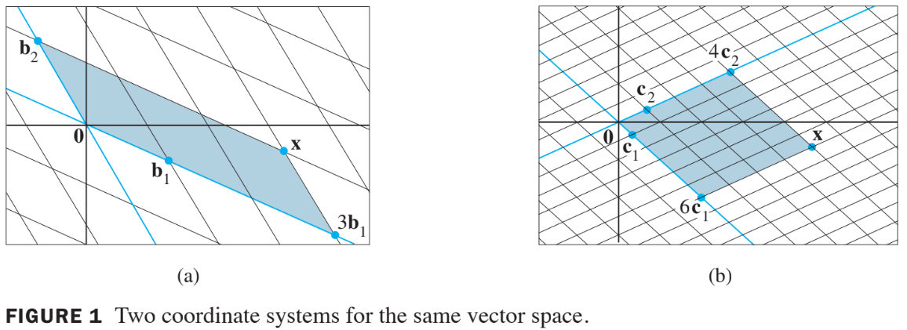
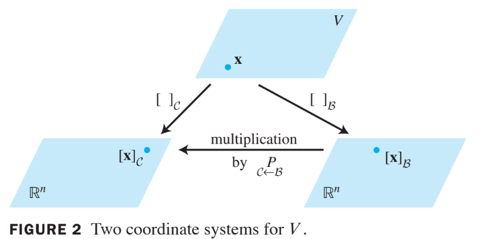

# Vector Spaces

# 4.7 Chage of Basis

## Example 1

Consider two bases $$B=\left\{ \textbf{b}_1, \textbf{b}_2 \right\}$$ 
and $$C=\left\{ \textbf{c}_1, \textbf{c}_2 \right\}$$ 
for a vector space $$V$$, such that
$$
\textbf{b}_1 = 4\textbf{c}_1 +\textbf{c}_2 \text{ and }
\textbf{b}_2 = -6\textbf{c}_1 +\textbf{c}_2 \tag{1}
$$

Suppose
$$
\textbf{x} = 3 \textbf{b}_1 +\textbf{b}_2 \tag{2}
$$

That is, suppose $$[\textbf{x}]_B = \begin{bmatrix}3 \\ 1 \end{bmatrix}$$.

Find $$[\textbf{x}]_C$$.

### Solution

* Apply the coordinate mapping determined by $$C$$ to $$\textbf{x}$$ in (2). 
  Since the coordinate mapping is a linear transformation,

$$
\begin{align}
[\textbf{x}]_C &= [3\textbf{b}_1 +\textbf{b}_2]_C \\
&= 3[\textbf{b}_1]_C +[\textbf{b}_2]_C
\end{align}
$$

* We can write the vector equation as a matrix equation, 
  using the vectors in the linear combination 
  as the columns of a matrix:

$$
[\textbf{x}]_C = \begin{bmatrix}
[\textbf{b}_1]_C & [\textbf{b}_2]_C \\
\end{bmatrix}
\begin{bmatrix}
3 \\ 1
\end{bmatrix}
\tag{3}
$$

* This formula gives $$[\textbf{x}]_C$$,
  once we know the columns of the matrix. From (1),

$$
[\textbf{b}_1]_C = 
\begin{bmatrix}
4 \\ 1
\end{bmatrix}
\text{ and }
[\textbf{b}_2]_C = 
\begin{bmatrix}
-6 \\ 1
\end{bmatrix}
$$

* Thus, (3) provides the solution:

$$
[\textbf{x}]_C = 
\begin{bmatrix}
4 & -6 \\ 1 & 1
\end{bmatrix}
\begin{bmatrix}
3 \\ 1
\end{bmatrix}
= 
\begin{bmatrix}
6 \\ 4
\end{bmatrix}
$$

* The $$C$$-coordinates of $$\textbf{x}$$ match those of the $$\textbf{x}$$ in Fig.1, as seen on the below.

## Theorem 15:

Let $$B=\left\{ \textbf{b}_1, \cdots, \textbf{b}_n \right\}$$ and
$$C=\left\{ \textbf{c}_1, \cdots, \textbf{c}_n \right\}$$
for a vector space $$V$$. Then there is a unique $$n \times n$$
matrix $$C \xleftarrow{P} B$$
such that

$$
[\textbf{x}]_C = C \xleftarrow[P]{} B[\textbf{x}]_B \tag{4}
$$

The columns of $$C \xleftarrow[P]{} B$$
are the $$C$$-coordinate vectors
of the vectors in the basis $$B$$. That is,

$$
C \xleftarrow[P]{} B
=
\begin{bmatrix}
[\textbf{b}_1]_C & [\textbf{b}_2]_C & \cdots &[\textbf{b}_n]_C 
\end{bmatrix} \tag{5}
$$

The matrix $$C \xleftarrow[P]{} B$$
in Theorem 15 is called the **change-of-coordinates matrix from $$B$$ to $$C$$**. 
Multiplication by $$C \xleftarrow[P]{} B$$
converts $$B$$-coordinates into $$C$$-coordinates.

Figure 2 below illustrates the change-of-coordinates
equation (4).

The columns of $$C \xleftarrow[P]{} B$$ are linearly independent 
because they are the coordinate vectors of the linearly independent
set $$B$$.

Since $$C \xleftarrow[P]{} B$$ is square, it must be invertible, 
by the Invertible Matrix Theorem. Left-multiplying both sides of equation (4)
by $$\left(C \xleftarrow[P]{} B\right)^{-1}$$ yields

$$
\left(C \xleftarrow[P]{} B\right)^{-1} [\textbf{x}\_C = [\textbf{x}r]_B
$$

Thus $$\left(C \xleftarrow[P]{} B\right)^{-1}$$
is the matrix that converts $$C$$-coordinates
into $$B$$-coordinates. That is,

$$
\left(C \xleftarrow[P]{} B\right)^{-1} = B \xleftarrow[P]{} C \tag{6}
$$

If $$B=\left\{ \textbf{b}_1, \cdots, \textbf{b}_n \right\} $$
and $$\epsilon$$ is the standard basis $$\left\{ \textbf{e}_1, \cdots, \textbf{e}_n \right\}$$ 
in $$\mathbb{R}^n$$, 
then $$[\textbf{b}_1]_\epsilon = \textbf{b}_1$$, 
and likewise for the other vectors
in $$B$$. In this case, $$\epsilon \xleftarrow[P]{} B$$
is the same as the change-of-coordinates matrix $$P_B$$
introduced in Section 4.4,
namely,

$$
P_B = \begin{bmatrix} \textbf{b}_1 & \textbf{b}_2 & \cdots & \textbf{b}_n \end{bmatrix}.
$$

To change coordinates between two nonstandard
bases in $$\mathbb{R}^n$$,
we need Theorem 15. The theorem
shows that to solve the change-of-basis problem,
we need the coordinate vectors of the old basis
relative to the new basis.

## Example 2

Let $$\textbf{b}_1 = \begin{bmatrix}-9 \\ 1 \end{bmatrix}, 
\textbf{b}_2 = \begin{bmatrix}-5 \\ -1 \end{bmatrix}, 
\textbf{c}_1 = \begin{bmatrix} 1 \\ -4 \end{bmatrix}, 
\textbf{c}_2 = \begin{bmatrix} 3 \\ -5 \end{bmatrix}$$
and consider the bases for $$\mathbb{R}^2$$ 
given by $$B=\left\{ \textbf{b}_1, \textbf{b}_2 \right\}$$
and $$C=\left\{ \textbf{c}_1, \textbf{c}_2 \right\}$$.

Find the change-of-coordinates matrix from $$B$$ to $$C$$.

### Solution 

* The matrix $$B \xleftarrow[p]{} C$$ involves 
  the $$C$$-coordinate vectors of $$\textbf{b}_1$$ and $$\textbf{b}_2$$. 
  Let $$[\textbf{b}_1]_C = \begin{bmatrix} x_1 \\ x_2 \end{bmatrix}$$ and 
  $$[\textbf{b}_2]_C = \begin{bmatrix} y_1 \\ y_2 \end{bmatrix}$$.
* Then by defintion,
$$
\begin{bmatrix}
c_1 & c_2
\end{bmatrix}
\begin{bmatrix}
x_1 \\ x_2
\end{bmatrix} 
=
\textbf{b}_1
\text{ and }
\begin{bmatrix}
c_1 & c_2
\end{bmatrix}
\begin{bmatrix}
y_1 \\ y_2
\end{bmatrix} 
=
\textbf{b}_2
$$
* To solve both systems simultaneously, augment the coefficient matrix with $$\textbf{b}_1$$ and $$\textbf{b}_2$$, and row reduce:

$$
\left[
\begin{array}{cc:cc}
c_1 & c_2 & b_1 & b_2 \\
\end{array}
\right]
=
\left[
\begin{array}{cc:cc}
1 & 3 & -9 & -5 \\ 
-4 & -5 & 1 & -1  
\end{array}
\right]
\sim
\left[
\begin{array}{cc:cc}
1 & 0 & 6 & 4 \\ 
0 & 1 & -5 & -3  
\end{array}
\right]
\tag{7}
$$

* Thus

$$
[\textbf{b}_1]_C = \begin{bmatrix} 6 \\-5 \end{bmatrix}
\text{ and }
[\textbf{b}_2]_C = \begin{bmatrix} 4 \\-3 \end{bmatrix}
$$

* The desired change-of-coordinates matrix is therefore

$$
C \xleftarrow[P]{} B =
\begin{bmatrix}
[\textbf{b}_1]_C  & [\textbf{b}_2]_C
\end{bmatrix}
=
\begin{bmatrix}
6 & 4 \\
-5 & -3 
\end{bmatrix}
$$
