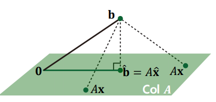

# Least Squares
@(LinearAlgebra)

# Summary

## Motivations for Least Squares

* Commonly, in the **over-determined system**,  there is no solution.
* Even if no solution exists, we want to **approximately obtain the solution** for the over-determined system.
* **Least Squares** provides the approximiation of the solution for the over-determined system.

## What is Least Squares Problem

Given an over-determined system $$A\textbf{x} \simeq \textbf{b}$$ where $$A \in \mathbb{R}^{m\times n}, \textbf{b} in \mathbb{R}^n$$, and $$m \gg n$$, a least square solution $$\hat{\textbf{x}}$$ is defined as

$$
\hat{\textbf{x}}= \text{arg } \underset{\textbf{x}} { \text{min }} \Vert \textbf{b}-A\textbf{x}
\Vert 
$$

* The most import aspect of the least-square problem is that no matter what $$\textbf{x}$$ is selected, the vector $$A\textbf{x}$$ will necessarily be in the column space Col $$A$$.
* Thus, the least square seeks for $$\textbf{x}$$ that makes $$A\textbf{x}$$ as the closet point in Col $$A$$ to $$\textbf{b}$$.

## Geometric Interpretation of Least Squares

* Consider $$\hat{\textbf{x}}$$ such that $$\hat{\textbf{b}} = A\hat{\textbf{x}}$$ is the closet point to $$\textbf{b}$$ among all vectors in Col $$A$$.
* That is, $$\textbf{b}$$ is closer to $$\hat{\textbf{b}}$$ than  $$A\textbf{x}$$ for any other $$\textbf{x}$$.
* To satisfy this, the vector $$\textbf{b}-A\hat{\textbf{x}}$$ should be orthogonal to Col $$A$$.

* This means $$\textbf{b}-A\hat{\textbf{x}}$$ should be orthogonal to any vector in Col $$A$$:

$$
\textbf{b}-A\hat{\textbf{x}} \perp (x_1 \textbf{a}_1 + x_2 \textbf{a}_2 + \cdots +x_n \textbf{a}_n  ) \text{ for any vector }\textbf{x}
$$

* Or equivalently,

$$
\begin{matrix}
\begin{matrix}
(\textbf{b}-A\hat{\textbf{x}}) \perp \textbf{a}_1 \\
(\textbf{b}-A\hat{\textbf{x}}) \perp \textbf{a}_2 \\
\vdots\\
(\textbf{b}-A\hat{\textbf{x}}) \perp \textbf{a}_m \\
\end{matrix}
\Rightarrow
\begin{matrix}
{\textbf{a}_1}^T (\textbf{b}-A\hat{\textbf{x}}) \\
{\textbf{a}_2}^T (\textbf{b}-A\hat{\textbf{x}}) \\
\vdots \\
{\textbf{a}_m}^T (\textbf{b}-A\hat{\textbf{x}})  \\
\end{matrix}
\Rightarrow
A^T(\textbf{b}-A\hat{\textbf{x}})=\textbf{0}
\Rightarrow
A^TA\hat{\textbf{x}})=A^T\textbf{b}
\end{matrix}
$$

* Finally, given a least squares problem, $$𝐴\textbf{𝐱} \simeq \textbf{b}$$, we obtain

$$
A^TA\hat{\textbf{x}}=A^T\textbf{b}
$$
  * which is called a normal equation.

* This can be viewed as a new linear system, $$C\textbf{x}=\textbf{d}$$,
where a square matrix $$C=A^TA \in \mathbb{R}^{n\times n}$$, and $$d=A^T\textbf{b} \in \mathbb{R}^n$$.
* If $$C = A^TA$$ is invertible, then the solution is computed as

$$
\hat{\textbf{x}} = (A^TA)^{-1}A^T\textbf{b}
$$

## Another Derivation of Normal Equation.

$$
\begin{align*}
\hat{\textbf{x}} &= \text{arg } \underset{\text{x}}{\text{min}} \Vert \textbf{b}-A\textbf{x} \Vert\\
&=\text{arg } \underset{\text{x}}{\text{min} } \Vert \textbf{b}-A\textbf{x} \Vert ^2\\
&=\text{arg } \underset{\text{x}}{\text{min} } (\textbf{b}-A\textbf{x} )^T(\textbf{b}-A\textbf{x})\\
&= \textbf{b}^T\textbf{b} - \textbf{x}^T A^T \textbf{b} - \textbf{b}^T A \textbf{x} + \textbf{x}^T A^T A \textbf{x}
\end{align*}
$$

* Computing derivatives with regard to $$\textbf{x}$$, we obtain

$$
- A^T \textbf{b} - A^T \textbf{b} + 2 A^T A \textbf{x} =\textbf{0} \Leftrightarrow A^T A \textbf{x} = A^T \textbf{b}
$$

* Thus, if $$C=A^TA$$ is invertible, then the solution is computed as

$$
\textbf{x} = (A^T A)^{-1} A^T \textbf{b}
$$

* $$C=A^TA$$ is always invertible! So, we can always approximate the solution, $$\hat{x}$$.

> * $$n$$차 방정식이 항상 $$n$$개의 complex solution 가짐.
> * $$n$$ dimensional square matrix has $$n$$ eigen values.
>   * 중복된 eigen value를 개별로 셀 경우임.
> * Matrix의 eigen vector들이 모두 linear independent일 경우, invertible 이며 diagonalizable임.
> *  Diagonalizable matrix의 eigen value에 0인 경우가 없을시 항상 invertible.
> * Symmetric matrix의 경우, eigne value는 real number이며, eigen vector들은 모두 orthgonal임. 
> * Symmetric matrix의 경우, 항상 diagonalizable임.
> * $$A^T A$$는 항상 symmetric matrix임.
> * $$A^T A$$는 최소한 positive semi-definite이며, 만일 0인 eigen value가 없을시 positive definite임.
> * Symmetric matrix가 positive definite인 경우, eigen value들은 모두 양수임. 즉 invertible하다.
> * Symmetric matrix가 positive semi-definite인 경우, eigen value들은 0또는 양수임.

## Orthogonal Projection Perspective

* In the case of invertible $$C=A^TA$$, consider the orthogonal projecton of $$\textbf{b}$$ onto Col $$A$$ as

$$
\hat{\textbf{b}}=f(\textbf{b})=A\hat{\textbf{x}}= A (A^TA)^{-1}A^T \textbf{b}
$$

* Suppose that Col $$A$$ is a  2-dimensional subspace , consider a transformation of orthogonal projection $$\hat{\textbf{b}}$$ of $$\textbf{b}$$, given **orthonomal** basis $$\left\{ \textbf{u}_1,\textbf{u}_2 \right\}$$ of Col $$A$$:

$$
\begin{align *}
\hat{\textbf{b}} &= f(\textbf{b}) \\
&=A\hat{\textbf{x}} \\
&= A (A^TA)^{-1}A^T \textbf{b} \\
&= (\textbf{b} \cdot \textbf{u}_1)\textbf{u}_1 + (\textbf{b} \cdot \textbf{u}_2)\textbf{u}_2 \\
&= (\textbf{u}_1^T\textbf{b})\textbf{u}_1 + (\textbf{u}_2^T\textbf{b})\textbf{u}_2 \\
&= \textbf{u}_1(\textbf{u}_1^T\textbf{b}) + \textbf{u}_2(\textbf{u}_2^T\textbf{b}) \\
&= (\textbf{u}_1\textbf{u}_1^T)\textbf{b} + (\textbf{u}_2\textbf{u}_2^T)\textbf{b} \\
&= (\textbf{u}_1\textbf{u}_1^T + \textbf{u}_2\textbf{u}_2^T)\textbf{b} \\
&= \begin{bmatrix} \textbf{u}_1 & \textbf{u}
_2\end{bmatrix}\begin{bmatrix} \textbf{u}_1^T \\ \textbf{u}
_2^T\end{bmatrix} \textbf{b} \\
&=UU^T \textbf{b} \Rightarrow \text{linear transformation} 
\end{align *}
$$

* When $$A=U=\begin{bmatrix} \textbf{u}_1 & \textbf{u}
_2\end{bmatrix}$$ has orthonomal columns:

$$
C=A^TA=\begin{bmatrix} \textbf{u}_1^T \\ \textbf{u}
_2^T\end{bmatrix} \begin{bmatrix} \textbf{u}_1 & \textbf{u}
_2\end{bmatrix}=I
$$

* Thus,

$$
\begin{align *}
\hat{\textbf{b}} &= f(\textbf{b}) \\
&=A\hat{\textbf{x}} \\
&= A (A^TA)^{-1}A^T \textbf{b} \\
&= A (I)^{-1}A^T \textbf{b} \\
&= A A^T \textbf{b} \\
&= U U^T \textbf{b} \\
\end{align *}
$$
