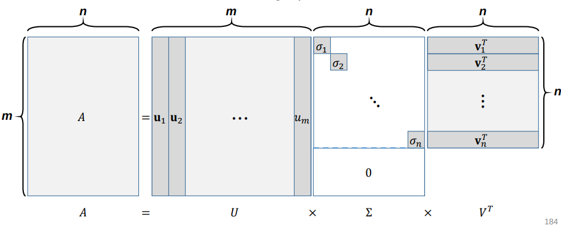
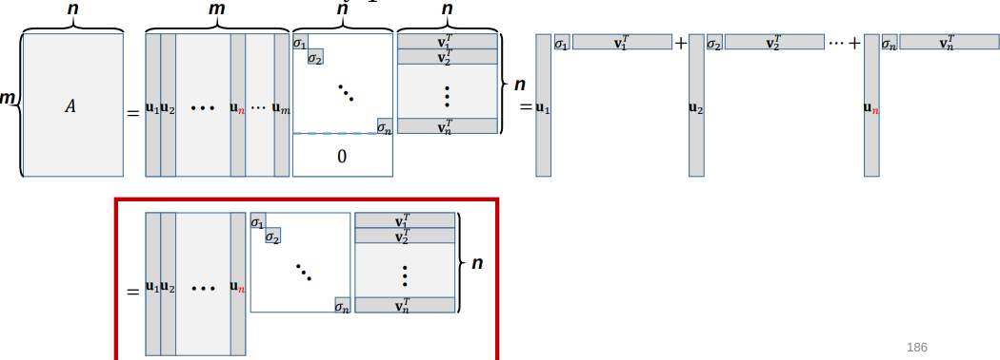

# Singular Value Decomposition (SVD)
@(LinearAlgebra)

## SVD

Given a **rectangular** matrix $$A \in \mathbb{R}^{m \times n}$$, its singular value decomposition is written as 
$$
A = U \Sigma V^T
$$ 

where
* $$U \in  \mathbb{R}^{m \times m}$$, $$V \in  \mathbb{R}^{n \times n}$$: matrices with orthonormal columns,
providing an orthonormal basis of Col $$A$$ and Row $$A$$, respectively.
* $$\Sigma  \in \mathbb{R}^{m \times n}$$: a diagonal matrix whose entries are in a decreasing
order, i.e., $$\sigma_1 \ge \sigma_2 \ge \cdots \ge \sigma_{min(m,n)}$$

## Basic Form of SVD

Given a **rectangular** matrix $$A \in \mathbb{R}^{m \times n}$$ where $$m \le n$$, SVD gives
$$
A = U \Sigma V^T
$$ 

## SVD as Sum of Rand 1 Outer Products

$$A$$ can also be represented as the sum of outer products
$$
A = U \Sigma V^T = \sum^n_{i=1} \sigma_i \textbf{u}_i\textbf{v}_i^T \text{,  where } \sigma_1 \ge \sigma_2 \ge \cdots \ge \sigma_n
$$

## Reduced Form of SVD

$$A$$ can also be represented as the sum of outer products
$$
A = U \Sigma V^T = \sum^n_{i=1} \sigma_i \textbf{u}_i\textbf{v}_i^T \text{,  where } \sigma_1 \ge \sigma_2 \ge \cdots \ge \sigma_n
$$

## Another Perspective of SVD

* We can easily find two orthonormal basis sets, $$\left\{ \textbf{u}_1, \cdots, \textbf{u}_n\right\}$$ for
Col $$A$$ and $$\left\{ \textbf{v}_1, \cdots, \textbf{v}_n\right\}$$ for Row $$A$$, by using, say, Gram–Schmidt orthogonalization.
* Are these unique orthonormal basis sets?
* No. Then, can we jointly find them such that
$$
A\textbf{v}_i = \sigma_i \textbf{u}_i \text{,  } \forall i = 1, \cdots, n
$$

* Let us denote $$U=\begin{bmatrix} \textbf{u}_1 & \textbf{u}_2 & \cdots & \textbf{u}_n\end{bmatrix} \in \mathbb{R}^{m\times n}$$, $$V=\begin{bmatrix} \textbf{v}_1 & \textbf{v}_2 & \cdots & \textbf{v}_n\end{bmatrix} \in \mathbb{R}^{n\times n}$$, and 
$$
\Sigma=\begin{bmatrix} \sigma_1 & 0 & \cdots & 0 \\
0 & \sigma_2 & \ddots & \vdots \\
\vdots & \ddots & \ddots & 0 \\
0 & \dots & 0 & \sigma_n \end{bmatrix} \in \mathbb{R}^{n\times n}
$$
* Consider $$AV=A\begin{bmatrix} \textbf{v}_1 & \textbf{v}_2 & \cdots & \textbf{v}_n\end{bmatrix}=\begin{bmatrix} A\textbf{v}_1 & A\textbf{v}_2 & \cdots & A\textbf{v}_n\end{bmatrix}$$ and
$$
\begin{align*}
U\Sigma &= \begin{bmatrix} \textbf{u}_1 & \textbf{u}_2 & \cdots & \textbf{u}_n\end{bmatrix}\begin{bmatrix} \sigma_1 & 0 & \cdots & 0 \\
0 & \sigma_2 & \ddots & \vdots \\
\vdots & \ddots & \ddots & 0 \\
0 & \dots & 0 & \sigma_n \end{bmatrix}  \\
&= \begin{bmatrix} \sigma_1\textbf{u}_1 & \sigma_2\textbf{u}_2 & \cdots & \sigma_n\textbf{u}_n\end{bmatrix}
\end{align*}
$$
* $$AV=U\Sigma \Leftrightarrow \begin{bmatrix} A\textbf{v}_1 & A\textbf{v}_2 & \cdots & A\textbf{v}_n\end{bmatrix}=\begin{bmatrix} \sigma_1 \textbf{u}_1 & \sigma_2 \textbf{u}_2 & \cdots & \sigma_n \textbf{u}_n \end{bmatrix}$$
* $$V^{-1} = V^T$$ since $$V \in \mathbb{n \times n}$$ has orthonormal columns.
* Thus, $$AV=U\Sigma \Leftrightarrow A = U\Sigma V^T$$.

## Computing SVD

* First, we form $$AA^T$$ and $$A^TA$$ and compute eigendecomposition of each:
$$
AA^T = U\Sigma V^T (U\Sigma V^T)^T = U\Sigma V^TV\Sigma^T U^T =U\Sigma\Sigma^T U^T= U\Sigma^2 U^T \\
A^TA = (U\Sigma V^T)^TU\Sigma V^T  = V\Sigma^T U^TU\Sigma V^T =V\Sigma\Sigma^T V^T= V\Sigma^2 V^T
$$
* Can we find the following?
	1. Orthogonal eigenvector matrices $$U$$ and $$V$$
	2. Eigenvalues in $$\Sigma^2$$ that are all positive
	3. Eigenvalues in $$\Sigma^2$$ that are shared by $$AA^T$$ and $$A^TA$$
* Yes, since $$AA^T$$ and $$A^TA$$ are symmetric positive (semi-)definite.

## Symmetric Positive Definite Matrices and Spectral Decomposition

• If $$S \in \mathbb{R}^{n \times n}$$ is **symmetric** and **positive-definite**, then the spectral decomposition will have all positive eigvenvalues: 

$$
\begin{align*}
S = UDU^T &= \begin{bmatrix} \textbf{u}_1 & \textbf{u}_2 & \cdots & \textbf{u}_n\end{bmatrix} \begin{bmatrix} \lambda_1 & 0 & \cdots & 0 \\
0 & \lambda_2 & \ddots & \vdots \\
\vdots & \ddots & \ddots & 0 \\
0 & \dots & 0 & \lambda_n \end{bmatrix}
\begin{bmatrix} \textbf{u}_1^T \\ \textbf{u}_2^T \\ \vdots \\ \textbf{u}_n^T\end{bmatrix} \\
&=  \lambda_1\textbf{u}_1\textbf{u}_1^T+\lambda_2\textbf{u}_2\textbf{u}_2^T+\cdots+\lambda_n\textbf{u}_n\textbf{u}_n^T
\end{align*} 
$$

where $$\lambda_j \ge 0, \forall j=1, \cdots, n$$.

## $$A^TA$$ and $$AA^T$$ are symmetric positive (semi-)definite!

* Symmetric:
$$
(AA^T)^T = AA^T \\
(A^TA)^T = A^TA \\
$$

* Positive (semi-)definite
$$
\textbf{x}^TAA^T\textbf{x} = (A^T\textbf{x})^T(A^T\textbf{x}) = ||A^T\textbf{x}||^2 \ge 0 \\
\textbf{x}^TA^TA\textbf{x} = (A\textbf{x})^T(A\textbf{x}) = ||A\textbf{x}||^2 \ge 0 
$$

* Thus, we can find
	1. Orthogonal eigenvector matrices $$U$$ and $$V$$.
	2. Eigenvalues in $$\Sigma^2$$ that are all positive

## Things to Note
* Given any rectangular matrix  $$A \in \mathbb{R}^{m \times n}$$, its SVD always exists.
* Given a square matrix $$A \in \mathbb{R}^{n \times n}$$, its eigendecomposition does not always exist, but its SVD always exists.
* Given a square, symmetric positive (semi-)definite matrix $$S \in \mathbb{R}^{n \times n}$$, its eigendecomposition always exists, and it is actually the same as its SVD. 

